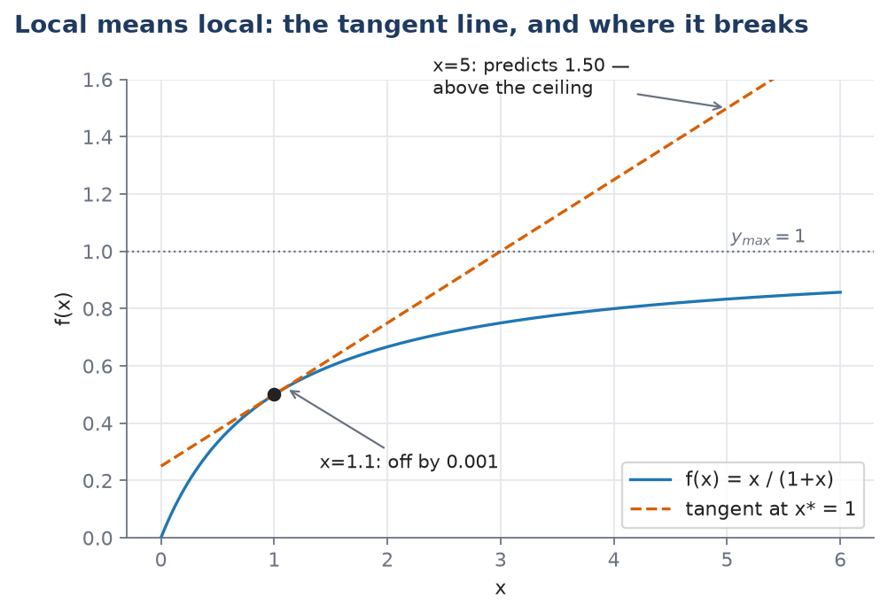

# L02 — The Mathematical Toolkit

**Practical:** [](https://colab.research.google.com/github/lab-biotek-bio-ugm/TKBM262615_Practicals/blob/main/notebooks/01_ode_intro.ipynb) `01_ode_intro`

*TKBM262615, Lecture 2. Draws on [[derivative]], [[differentiation-rules]],
[[partial-derivative]], [[implicit-differentiation]], [[state-variable-and-parameter]],
[[linearity-and-nonlinearity]], [[local-versus-global-behaviour]], [[vector-and-matrix]], and
[[nullspace]]. Source: Ingalls Appendix B.1–B.2 and §1.5.*

By the end of this lecture you should be able to:

1. Read a rate off a time course, and state its units and what the number means physically.
2. Name every symbol in $\dfrac{d\mathbf{x}}{dt} = f(\mathbf{x}, \mathbf{p})$, and say whether a
   given quantity is a state variable or a parameter for a stated time-scale.
3. Integrate a one-variable ODE in Python with `solve_ivp` and plot it.
4. Compute an inner product and a matrix-vector product by hand, and check whether a given vector
   lies in a matrix's nullspace.

L01 argued that you need equations, not cartoons. This lecture builds the two pieces of mathematics
every equation in this course is made of: the derivative, and just enough linear algebra to write a
network's bookkeeping compactly. Almost none of it is new content in the sense of "things you've
never seen" — most of you have differentiated before. What's new is treating the results as
physical quantities rather than symbol manipulations, and that distinction is the whole lecture.

## Retrieval: what L01 left you holding

Before anything new, answer these from memory:

1. Give one example from L01 where verbal reasoning about a network gave the wrong answer, and say
   what was wrong with the reasoning.
2. "Negative feedback always stabilises a system." Is this true? If not, what is missing from it?
3. Name one thing a model bought in one of L01's four case studies, in one sentence.

## The hook: a rate you can already read

Here is a measured time course — a concentration, rising, then bending over as it approaches a
ceiling. No formula, just the curve. Pick a point partway up the bend. How fast is the
concentration changing *right there*?

You already have an intuition: steeper means faster. This lecture makes that intuition exact,
gives it units, and then asks you to trust it as a physical statement rather than a picture.

## The derivative, as a rate

### From two points to one

Start with something you already trust completely: an **average rate of change**. Suppose a
concentration $[A]$ was $2$ mM at $t = 10$ s and $5$ mM at $t = 20$ s. It rose by $3$ mM over $10$
s, so on average it rose at

$$\frac{5\text{ mM} - 2\text{ mM}}{20\text{ s} - 10\text{ s}} = 0.3\ \text{mM}\!\cdot\!\text{s}^{-1}$$

That's a slope: rise over run, the slope of the straight line through the two points.

Now ask a sharper question: what was the rate *at $t = 10$ s exactly*, not averaged over the next
ten seconds? Move the second point closer to the first — $t = 15$ s, then $t = 11$ s, then $t =
10.1$ s. Each time you get a new average rate, and as the second point approaches the first, the
straight line through the two points pivots and settles onto the line that just grazes the curve at
$t=10$ s: the **tangent**. That limiting slope is the derivative.

Here's why this needs a name and a limit rather than just "plug in the same point twice": at the
moment the two points coincide, both the rise and the run are zero, and $0/0$ is not a number — it
says nothing at all. So the derivative is defined as what the ratio *approaches* as the points come
together, never as what it equals when they meet. That's the entire job of the word "limit."

### The definition

Take two points, $x_0$ and $x$, on the input axis of a function $f$. Their average rate of change
is

$$\frac{f(x) - f(x_0)}{x - x_0} \tag{B.1}$$

Both differences here are ordinary subtractions and the ratio is an ordinary division — nothing new
yet. A **limit**, written $\lim_{x \to x_0} h(x)$, is the value a function would be expected to take
at $x_0$ based on its behaviour at points near $x_0$ — without ever evaluating it exactly at $x_0$.

The **derivative** of $f$ at $x_0$ is the limit of (B.1) as $x$ closes in on $x_0$:

$$\left.\frac{d}{dx}f(x)\right|_{x = x_0} \;=\; \lim_{x \to x_0}\frac{f(x) - f(x_0)}{x - x_0} \tag{B.2}$$

Two notations for the same thing at an unspecified point: $\frac{d}{dx}f(x)$, or the shorthand
$\frac{df}{dx}$. Write the vertical bar, $\big|_{x=x_0}$, when you mean the value at one particular
place — that's a **number**. Without the bar, $\frac{df}{dx}$ is a **function**: it has its own
value at every point where $f$ is differentiable.

Because the derivative is itself a function, it can have its own derivative — the **second
derivative**, $\frac{d^2}{dx^2}f(x)$. If the first derivative is a rate, the second is how fast that
rate itself is changing.

**Say it once, plainly, because everything after this depends on it:** a derivative is a rate, and
rates have units. If $[A]$ is measured in mM and $t$ in seconds, then $\frac{d[A]}{dt}$ is measured
in mM·s⁻¹, every single time. This is not a special property of any one model — it's what
"derivative" *means*.

### Worked example — computing one from the definition

We want the derivative of $f(x) = x^2$ at $x_0 = 3$, and we're going to get it from the definition
(B.2) rather than a shortcut, so that the definition earns its keep once before you stop using it
directly.

Form the difference quotient (B.1) with $f(x) = x^2$ and $x_0 = 3$:

$$\frac{f(x) - f(3)}{x - 3} = \frac{x^2 - 9}{x - 3}$$

The numerator factors as a difference of squares:

$$= \frac{(x-3)(x+3)}{x - 3}$$

For any $x \ne 3$, the factor $(x - 3)$ in the numerator and denominator cancels — and we're allowed
to do this, because the limit only ever examines $x$ *near* 3, never $x$ equal to 3 itself:

$$= x + 3$$

Now let $x \to 3$. The expression $x + 3$ approaches $6$ — no cancellation trick needed at this
step, since $x + 3$ has no problem at $x = 3$. So

$$\left.\frac{d}{dx}x^2\right|_{x=3} = 6$$

Compare this against the power rule below, $\frac{d}{dx}x^n = nx^{n-1}$, which gives $2x$, and at
$x=3$ that's also $6$. They agree, as they must — the rules in the next section are just faster
routes to the same limit.

## Differentiation rules — a reference, not a lecture

Computing every derivative from the limit is, in Ingalls' word, "cumbersome." These ten rules let
you skip it. Learn to look them up, not to recite them.

| # | Rule | Statement |
|---|---|---|
| 1 | Constant | $\dfrac{d}{dx}c = 0$ |
| 2 | Identity | $\dfrac{d}{dx}x = 1$ |
| 3 | Power | $\dfrac{d}{dx}x^n = n x^{n-1}$ |
| 4 | Exponential | $\dfrac{d}{dx}e^x = e^x$ |
| 5 | Natural log | $\dfrac{d}{dx}\ln(x) = \dfrac{1}{x}$ |
| 6 | Scalar multiple | $\dfrac{d}{dx}\,c\,f(x) = c\,\dfrac{d}{dx}f(x)$ |
| 7 | Addition | $\dfrac{d}{dx}\big(f_1 + f_2\big) = \dfrac{df_1}{dx} + \dfrac{df_2}{dx}$ |
| 8 | Product | $\dfrac{d}{dx}\big(f_1 f_2\big) = f_1\dfrac{df_2}{dx} + f_2\dfrac{df_1}{dx}$ |
| 9 | Quotient | $\dfrac{d}{dx}\dfrac{f_1}{f_2} = \dfrac{f_2\frac{df_1}{dx} - f_1\frac{df_2}{dx}}{[f_2]^2}$ |
| 10 | Chain | $\dfrac{d}{dx}f_1(f_2(x)) = \left.\dfrac{df_1}{dw}\right|_{w = f_2(x)}\cdot\dfrac{df_2}{dx}$ |

Rules 6 and 7 together are what it means for differentiation to be **linear** — see
[[linearity-and-nonlinearity]] below for what that word buys you in general. Rules 8 and 9 exist
precisely *because* differentiation is not linear in products and quotients; you cannot just
differentiate the two pieces separately and multiply or divide the results.

The chain rule reads worst on the page and gets used the most. In words: differentiate the outer
function first, leaving the inner one untouched inside it, then multiply by the derivative of the
inner one.

### Worked example — reading the shape off the derivative

Take $r(s) = \dfrac{2s}{s+4}$. This is Exercise B.1.1(ii) in the book. Apply the quotient rule with
$f_1 = 2s$ (so $\frac{df_1}{ds} = 2$) and $f_2 = s + 4$ (so $\frac{df_2}{ds} = 1$):

$$\frac{dr}{ds} = \frac{2(s+4) - 2s(1)}{(s+4)^2} = \frac{2s + 8 - 2s}{(s+4)^2} = \frac{8}{(s+4)^2}$$

Now read what this says, not just what it equals. The derivative is $\frac{8}{(s+4)^2}$: **positive
everywhere** $s$ is defined here (a positive number over a squared, positive denominator), and it
**shrinks as $s$ grows** (a fixed numerator over a growing denominator). A function whose derivative
is always positive but always shrinking is rising, but rising at an ever-slower rate — exactly the
shape of [[saturation|a saturating curve]]. In fact $r(s)$ *is* one, with ceiling $y_{max}=2$ and
half-maximum point $K=4$: check $r(4) = 8/8 = 1 = y_{max}/2$. The derivative told you the shape
before you plotted anything.

This reading-the-shape skill matters more than table fluency. A common mistake is reaching for the
quotient rule whenever a fraction bar appears — try differentiating $\frac{x^2}{5}$ and notice rule
6 (scalar multiple, since $5$ is a constant) does it in one step, with no quotient rule needed.

## Partial derivatives — the same idea, one variable at a time

A reaction rate usually depends on more than one concentration. Mass action for $A + B \to C$ gives
a rate $k[A][B]$ — it depends on both $[A]$ and $[B]$. Asking "how fast does the rate change?" is
now an incomplete question: change with respect to $[A]$, or with respect to $[B]$? A multi-variable
function needs a separate rate of change for *each* input, and those are its **partial
derivatives**.

This is not new machinery. Freeze every input but one, and what's left is an ordinary
single-variable function, which you already know how to differentiate. The curly $\partial$ is a
reminder that something was held fixed — it is not a signal that a different kind of mathematics is
happening.

**In practice:** to compute $\partial g/\partial x_1$ for a function $g(x_1, x_2, x_3)$, treat $x_2$
and $x_3$ as if they were constants, and apply the ordinary rules from the table above to what's
left.

### Worked example

Take the mass-action rate $v([A],[B]) = k[A][B]$, with $k$ a fixed rate constant.

To find $\partial v/\partial[A]$, treat $[B]$ as a constant, call it $c$. Then $v = (kc)\cdot[A]$ —
a constant multiplied by $[A]$ — so by the scalar-multiple rule (6) and identity rule (2):

$$\frac{\partial v}{\partial [A]} = k[B]$$

By the same argument with the roles swapped,

$$\frac{\partial v}{\partial [B]} = k[A]$$

Read what these say. The sensitivity of the reaction rate to $[A]$ is proportional to how much $[B]$
is present. If there is no $B$ at all, adding more $A$ changes the rate not at all — which matches
the chemistry, since a reaction needing both reactants can't proceed with only one, and it's
satisfying that the mathematics says so without being told.

> [!question]- Optional stretch: implicit differentiation
> Sometimes a function is given by an equation, not a formula — you can't isolate $f(x)$ on one
> side. Ingalls' example: $x + f(x) = (1+f(x))^{-3}$. You can still get $\frac{df}{dx}$: differentiate
> both sides (using the chain rule wherever $f(x)$ appears), then solve the resulting equation for
> $\frac{df}{dx}$ as if it were an ordinary unknown. The answer will still contain $f(x)$ — that's
> expected, since an implicit definition gives an implicit derivative — but you never needed a
> formula for $f$ itself. This shows up again in L05, where the Lineweaver-Burk transformation is
> essentially a change of variables chosen to dodge exactly this kind of awkwardness. Not examined
> this term; see [[implicit-differentiation]] if you want the full worked derivation.

## What a rate equation is made of: state and parameter

### Two roles, and which is which depends on the question

A model tracks some quantities as they change and holds others fixed. The ones it tracks are
**state variables** — for a reaction network, one per molecular species, usually its concentration.
Together they form the **state**: a complete description of the system's condition at one instant.
The model's dynamic behaviour is nothing more than the time course of the state — how those numbers
move.

**Parameters** are everything else the equations need: association constants, maximal expression
rates, degradation rates. They characterise the interactions and the environment rather than the
momentary condition of the system.

Write the state of a three-species model as a list:

$$\mathbf{x}(t) = \big([A](t),\; [B](t),\; [C](t)\big)$$

The bold $\mathbf{x}$ is the whole state; $t$ is time; each entry is a concentration — say, in
millimolar (mM). A dynamic model is a rule for how $\mathbf{x}$ changes:

$$\frac{d\mathbf{x}}{dt} = f(\mathbf{x}, \mathbf{p})$$

Read it left to right, and be able to say what every symbol is:

- $\frac{d\mathbf{x}}{dt}$ — the rate of change of each concentration in the state, in units of
  concentration per unit time.
- $f$ — a function you build from the chemistry, starting in L03.
- $\mathbf{p}$ — the list of parameters. The reason it's written separately from $\mathbf{x}$ is
  that $\mathbf{p}$ does **not** depend on $t$: across one simulation run, $\mathbf{p}$ sits still
  while $\mathbf{x}$ moves.

One more ingredient, neither a state variable nor a parameter: the **initial condition**
$\mathbf{x}(0)$, the state at the moment you start watching. Changing $\mathbf{p}$ means changing
the system or its environment; changing $\mathbf{x}(0)$ means starting the same system somewhere
else.

### Worked example, with a unit check

$$\frac{d[A]}{dt} = k_0 - k_1 [A]$$

One state variable, $[A]$, in mM. Two parameters: $k_0$, a constant production rate in
mM·s⁻¹, and $k_1$, a degradation rate constant in s⁻¹. Check the units before trusting the
equation: $k_1[A]$ has units $\text{s}^{-1}\cdot\text{mM} = \text{mM}\!\cdot\!\text{s}^{-1}$, which
matches $k_0$ and matches the left-hand side $d[A]/dt$. This dimensional check costs one line and
is the cheapest error-catcher you own — do it on every equation you write from here on.

### It's a modelling choice, not a fact about the world

Ingalls is explicit that the state/parameter split "depends on the model's context and on the
time-scale over which simulations run." His example is enzyme abundance. In a metabolic model
running over seconds to minutes, the enzyme pool doesn't change appreciably during the run, so
treating it as a **parameter** is reasonable. In a gene-regulatory model running over hours — where
the enzyme's own production is being controlled — that same enzyme's abundance is a time-varying
**state variable**.

Nothing about the enzyme changed between these two descriptions. The *question* changed. This same
reasoning reappears in L04 as the [[quasi-steady-state-approximation|quasi-steady-state
approximation]], so it's worth having landed here first.

## Linearity and nonlinearity

### The test

A relationship is **linear** if it is a direct proportionality: $y = kx$ for a fixed constant $k$.
The formal test, which applies to any function $f$ and works for more complicated cases too: $f$ is
linear if both of the following hold for every input and every constant $c$:

$$f(x_1 + x_2) = f(x_1) + f(x_2) \qquad\text{and}\qquad f(cx) = c\,f(x)$$

In words: the response to a sum of inputs equals the sum of the individual responses, and scaling
the input scales the response by the same factor — no more, no less.

Check $f(x) = kx$: $k(x_1+x_2) = kx_1 + kx_2$ ✓, and $k(cx) = c(kx)$ ✓. Linear.

Check $f(x) = x^2$: expand $(x_1+x_2)^2 = x_1^2 + 2x_1x_2 + x_2^2$. This is **not** equal to
$x_1^2 + x_2^2$ — there's a leftover cross-term, $2x_1x_2$. That term is the two inputs
*interfering* with each other, which is exactly what linearity forbids. Nonlinear.

### Why this matters immediately

The mass-action rate for $A + B \to C$ is $k[A][B]$ — a product of two variables. A product of
variables is never linear (apply the test above to $f([A],[B]) = k[A][B]$ and you'll find the same
kind of cross-term). **So even the simplest two-reactant chemistry in this course is already
outside linear theory**, before you've written a single differential equation. This is why almost
nothing interesting in biology is linear, and it's the reason [[complex-system|complex behaviour]]
— two stable states, oscillation, switching — needs nonlinearity to exist at all. A linear model has
nowhere to put a second stable state; a proportionality only ever has one answer.

Ingalls names two nonlinear shapes that recur throughout this course, both called
[[saturation]]: hyperbolic, which bends over immediately and flattens, and sigmoidal, which stays
flat, then rises switch-like, then flattens. You met both informally in L01; L05 and L06 derive them
from mechanism.

> [!note] A one-sentence aside
> A straight line that misses the origin, $y = mx+b$ with $b \ne 0$, fails the test above (check
> $f(cx) \ne c f(x)$ unless $b=0$) and is technically *affine*, not linear. Ingalls doesn't draw this
> distinction and neither does this course, but it's worth knowing the word exists.

## Local versus global behaviour

### The escape from "nonlinear models are hard"

A full account of everything a nonlinear model can do, under every possible condition, is usually
out of reach. So don't ask for it — ask instead what the system does **near one operating point**,
where "operating point" just means a value of $x$ you care about, often a [[steady-state|steady
state]].

The mathematical fact making this work is one you already have: a smooth curve, viewed closely
enough, looks like a straight line — that's what a tangent line *is*. The objection is obvious and
worth taking seriously before dismissing it: doesn't throwing away everything except the local slope
lose too much? Two answers. First, the global behaviour of many systems is largely determined by
what happens near a handful of operating points, so understanding those points well captures most of
what matters. Second, self-regulating biological systems — by design — spend most of their time in a
narrow band near an operating point, so the approximation is most accurate exactly where the system
actually lives.

### The mathematics

For a nonlinear function $f(x)$ and an operating point $x^*$, the tangent-line approximation is:

$$f(x) \;\approx\; f(x^*) \;+\; \left.\frac{df}{dx}\right|_{x = x^*} (x - x^*)$$

Read each piece: $f(x^*)$ is the value at the operating point; $\left.\frac{df}{dx}\right|_{x=x^*}$
is the derivative — a single number, evaluated *at* $x^*$, not a function; $(x - x^*)$ is how far
you've moved away from the operating point. In words: *value at the point, plus slope times
displacement.* The approximation is good when the displacement is small and degrades as it grows,
at a rate that depends on how curved $f$ is.

### Worked example, with a warning built in

Take the saturating curve $f(x) = \dfrac{x}{1+x}$ (this is [[saturation]] with $y_{max}=1$,
$K=1$), and linearise it at the operating point $x^* = 1$.

First, the value at the point: $f(1) = \frac{1}{1+1} = \frac{1}{2}$.

Next, the derivative. By the quotient rule with $f_1 = x$ (derivative 1) and $f_2 = 1+x$ (derivative
1):

$$f'(x) = \frac{(1)(1+x) - x(1)}{(1+x)^2} = \frac{1}{(1+x)^2}$$

At $x^*=1$: $f'(1) = \frac{1}{4}$.

So the local linear model is:

$$f(x) \approx \frac{1}{2} + \frac{1}{4}(x - 1)$$

Now check it at two points, one close to $x^*$ and one far:

- At $x = 1.1$: the approximation gives $\frac{1}{2} + \frac{1}{4}(0.1) = 0.525$. The true value is
  $f(1.1) = 1.1/2.1 \approx 0.5238$. Off by about $0.0012$ — good to roughly two parts in a thousand.
- At $x = 5$: the approximation gives $\frac{1}{2} + \frac{1}{4}(4) = 1.5$. The true value is
  $f(5) = 5/6 \approx 0.833$.

The second case is not merely "less accurate" — the approximation has predicted a value of $1.5$
for a quantity whose ceiling, $y_{max}$, is $1$. That's not a rounding error; it's a physically
impossible answer. **Local means local**, and the figure below makes it visible: near $x^*=1$ the
tangent line and the curve are indistinguishable, and past a certain point they aren't describing
the same thing at all.



*(Regenerated by `figs/local_linear.py`; the two check values above are computed and asserted in
the script, not eyeballed off the plot.)*

This page is a promise for L04: exactly this technique — linearising a model near a steady state —
is how you'll decide whether that steady state is one the system returns to after a small
disturbance.

## Vectors and matrices, at the depth this course needs

You need linear algebra here for one purpose only: writing a reaction network's bookkeeping
compactly, and finding its conservation relations via the nullspace next lecture. Nothing beyond
that is required.

### The building blocks

A **column vector** is $n$ numbers stacked vertically; a **row vector** is the same numbers side by
side. A **matrix** is a rectangular grid — with $n$ rows and $m$ columns, it's $n$-by-$m$.
**Rows first, then columns**, always — this convention gets reversed constantly, so say it twice.

$$M = \begin{bmatrix} 3 & 1 & 0 \\ -1 & -1 & 6 \end{bmatrix} \quad\text{is 2-by-3.}$$

The **transpose**, $M^T$, flips the matrix across its diagonal, turning rows into columns; an
$n$-by-$m$ matrix's transpose is $m$-by-$n$.

Why bother with any of this? Because a reaction network naturally has one row per species and one
column per reaction, and once that's a matrix, the network's whole bookkeeping becomes a single
multiplication — next lecture's payoff.

### The inner product, and everything built from it

Two vectors of equal length multiply to a single number (a **scalar**): pair up corresponding
entries, multiply each pair, and add:

$$[1\;4\;7\;{-3}]\cdot\begin{bmatrix}2\\-5\\-4\\1\end{bmatrix} = (1)(2)+(4)(-5)+(7)(-4)+(-3)(1) = 2-20-28-3 = -49$$

A **matrix-vector product** is nothing more than one inner product per row: treat the matrix as a
stack of row vectors, take the inner product of each row with the vector, and stack the resulting
numbers:

$$\begin{bmatrix} 1 & 4 & 7 & -3 \\ 0 & 3 & -1 & 1 \\ 2 & 2 & 0 & 0\end{bmatrix}\cdot\begin{bmatrix}2\\-5\\-4\\1\end{bmatrix} = \begin{bmatrix}-49\\-10\\-6\end{bmatrix}$$

Check the middle row by hand: $(0)(2)+(3)(-5)+(-1)(-4)+(1)(1) = 0-15+4+1 = -10$. ✓

**The shape rule follows from this, rather than being a separate fact to memorise.** Each row's
inner product needs to pair with the *whole* vector, so the matrix must have as many columns as the
vector has entries; the result has one entry per row of the matrix.

```python
# /// script
# dependencies = ["numpy"]
# ///
import numpy as np

M = np.array([[1, 4, 7, -3],
              [0, 3, -1, 1],
              [2, 2, 0, 0]])
y = np.array([2, -5, -4, 1])

print(M @ y)              # [-49 -10  -6]  -- @ is matrix multiplication, never use *
```

For square matrices, the **identity** $I$ (ones on the diagonal, zeros elsewhere) plays the role of
$1$: $MI = IM = M$. The **inverse** $M^{-1}$, when it exists, satisfies $MM^{-1}=M^{-1}M=I$ — but
only square matrices can have one, and **many square matrices have none at all**. That last fact is
not a technicality; it is exactly the situation the next section is about.

## The nullspace surprise

For ordinary numbers, if $ab = 0$ then $a=0$ or $b=0$ — there's no other way to get zero from
multiplication. Try the same thing with vectors:

$$[1\;\;{-1}]\cdot\begin{bmatrix}2\\2\end{bmatrix} = (1)(2) + (-1)(2) = 2 - 2 = 0$$

Neither vector is zero, and the product is zero anyway. For numbers this cannot happen; for vectors
it happens routinely, because an inner product **adds up** contributions, and additions can cancel.

When $Mv$ is the zero vector — every entry zero — we say $v$ is in the **nullspace** of $M$. The
nullspace isn't just a scattered set of such vectors either: if $v$ is in it, so is $cv$ for any
constant $c$ (since $M(cv) = c(Mv) = c\cdot 0 = 0$), and if $v$ and $w$ are both in it, so is
$c_1v + c_2w$ for any constants (by the same reasoning applied twice). The nullspace is a whole
*space*, closed under scaling and combination — find two independent vectors in it and you've found
every vector in it, not just two of infinitely many unrelated ones.

Read the surprising example above biologically for a moment, even without a real reaction yet. The
row $[1\;\;{-1}]$ says "one of the first thing appears for every one of the second that
disappears." The vector $[2\;\;2]^T$ says "there are 2 of each right now." Their product being zero
says the total is unchanged. **That is a conservation law**, and finding one is exactly what you'll
do with a real two-reaction network next lecture — a stoichiometry matrix's nullspace vectors are
its conservation relations. Hold that promise; L03 is where it gets a body.

## Putting the pieces to work: a Python demo

You now know what every symbol in $\frac{d[A]}{dt} = k_0 - k_1[A]$ means, and you know it's a
statement about a rate. Here it is integrated numerically and plotted — treat `solve_ivp` as a tool
today; how it gets from one point to the next, and what can go wrong, is L04's subject in full,
once L03 has given you a real network to run it on.

```python
# /// script
# dependencies = ["numpy", "scipy", "matplotlib"]
# ///
"""L02 demo -- integrate dA/dt = k0 - k1*A and plot it. solve_ivp is used as a tool here;
its internals (step size, error, Euler's method) are L04's subject."""
import numpy as np
from scipy.integrate import solve_ivp
import matplotlib.pyplot as plt


def rhs(t, A, k0, k1):
    return [k0 - k1 * A[0]]


def main():
    k0, k1 = 2.0, 0.5                       # mM/s, 1/s
    sol = solve_ivp(rhs, (0, 20), [0.0], args=(k0, k1), dense_output=True)
    t = np.linspace(0, 20, 200)
    A = sol.sol(t)[0]

    fig, ax = plt.subplots()
    ax.plot(t, A)
    ax.axhline(k0 / k1, linestyle="--", color="grey")   # the steady state from L01's analysis
    ax.set_xlabel("time (s)")
    ax.set_ylabel("[A] (mM)")
    fig.savefig("l02_demo.png")
    print(f"A(20) = {A[-1]:.4f}   steady state k0/k1 = {k0/k1:.4f}")


if __name__ == "__main__":
    main()
```

Every argument in that `solve_ivp` call has a name you learned today: `rhs` is $f$; `(0, 20)` is the
time span; `[0.0]` is $\mathbf{x}(0)$; `args=(k0, k1)` is $\mathbf{p}$, passed explicitly rather than
as a global, exactly as [[state-variable-and-parameter]] describes the split.

## Problem set

### Performance task — worked, faded, independent (due before L03)

**1. Worked — reproduce this from memory.** Differentiate $v(s) = \dfrac{V_{max}\,s}{K+s}$ using the
quotient rule. If $s$ is a concentration in µM and $V_{max}$ is a rate in µM·min⁻¹, state the units
of $\dfrac{dv}{ds}$, and say in one sentence what the sign of the derivative tells you about the
shape of $v$.

> [!success]- Worked solution
> Quotient rule with $f_1 = V_{max}s$ (derivative $V_{max}$) and $f_2 = K+s$ (derivative $1$):
> $$\frac{dv}{ds} = \frac{V_{max}(K+s) - V_{max}s(1)}{(K+s)^2} = \frac{V_{max}K}{(K+s)^2}$$
> Units: $V_{max}$ is µM·min⁻¹, $K$ and $(K+s)^2$ carry µM and µM², so
> $\dfrac{[\mu M \cdot min^{-1}][\mu M]}{[\mu M]^2} = min^{-1}$ — a derivative of a rate with respect
> to a concentration comes out in inverse time, which is correct since $v$'s own units are
> µM·min⁻¹ and $s$'s are µM: (µM·min⁻¹)/(µM) = min⁻¹. The derivative is positive everywhere ($K>0$,
> $s\ge0$) and shrinks as $s$ grows, which is the saturating shape: $v$ always rises, but at an
> ever-diminishing rate as it nears $V_{max}$.

**2. Partially faded.** A gene's transcription rate is $g([R]) = \dfrac{\beta}{1 + ([R]/K)^n}$,
where $[R]$ is a repressor's concentration. The outer function is $w^{-1}$ scaled by $\beta$, and
the inner function is $w = 1 + ([R]/K)^n$; the chain rule gives
$\dfrac{dg}{d[R]} = -\beta w^{-2}\cdot\dfrac{dw}{d[R]}$. Finish it: find $\dfrac{dw}{d[R]}$, assemble
the full derivative, and state its sign and what that sign means for the biology.

> [!success]- Answer
> $\dfrac{dw}{d[R]} = n([R]/K)^{n-1}\cdot\frac{1}{K}$ (power rule plus the constant $1/K$ inside).
> Assembling: $\dfrac{dg}{d[R]} = -\dfrac{\beta\, n\, ([R]/K)^{n-1}/K}{\big(1+([R]/K)^n\big)^2}$.
> Every factor is positive except the leading minus sign, so the derivative is **negative**
> everywhere: more repressor always means less transcription, never more — consistent with calling
> $[R]$ a repressor in the first place.

**3. Independent.** A model has $\dfrac{d[X]}{dt} = k_1[A][B] - k_2[X]$, with $[A]$ held constant
over the time-scale of interest while $[B]$ varies.
**(a)** Is $[A]$ a state variable or a parameter here, and why — specifically for *this*
time-scale?
**(b)** Is the production term $k_1[A][B]$ linear in $[B]$? Justify using the two-part linearity
test.
**(c)** Compute $\dfrac{\partial (k_1[A][B])}{\partial [B]}$ and say what it means.

> [!success]- Model answer
> **(a)** A **parameter**. Being "held constant" is the *symptom*; the *reason* it's reasonable is
> that on the time-scale this model is being run over, whatever process controls $[A]$'s own
> abundance is slow enough (or buffered enough) that $[A]$ doesn't move appreciably while $[X]$ and
> $[B]$ do their thing — exactly the enzyme-abundance reasoning from earlier in this lecture.
>
> **(b)** With $[A]$ now fixed at some constant $c$, the term is $k_1 c\,[B]$ — a fixed constant
> times $[B]$, which passes the test directly: $k_1c(x_1+x_2) = k_1cx_1+k_1cx_2$ and
> $k_1c(\alpha x) = \alpha(k_1cx)$. **Linear in $[B]$**, given that $[A]$ is being treated as a
> parameter. (Note this is a different question from whether $k_1[A][B]$ is linear in *both*
> variables together — it isn't, because it's still a product of two things that could both vary.)
>
> **(c)** Treating $[A]$ as a constant, $\dfrac{\partial(k_1[A][B])}{\partial[B]} = k_1[A]$: the
> sensitivity of the production rate to $[B]$ is proportional to how much $[A]$ is around. More $A$
> present makes the reaction more sensitive to changes in $B$.

### Exit ticket

Give one quantity from your own biology background that would be a **parameter** in a model at one
time-scale and a **state variable** in a model at another. Say what the two time-scales are.
