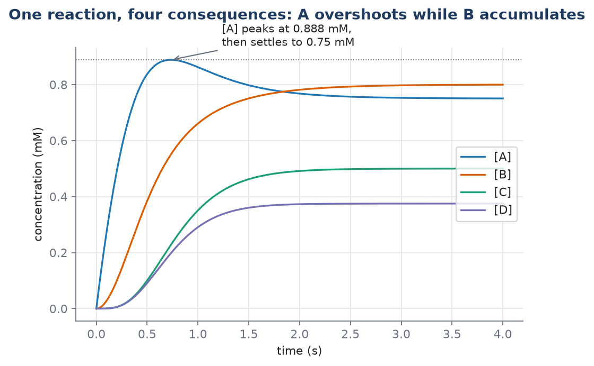

# L03 — Reaction Networks and Mass Action

**Practicals:** [](https://colab.research.google.com/github/lab-biotek-bio-ugm/TKBM262615_Practicals/blob/main/notebooks/02_mass_action.ipynb) `02_mass_action` · [](https://colab.research.google.com/github/lab-biotek-bio-ugm/TKBM262615_Practicals/blob/main/notebooks/02_simple_networks.ipynb) `02_simple_networks`

*TKBM262615, Lecture 3. Draws on [[reaction-network]], [[law-of-mass-action]],
[[writing-odes-from-a-reaction-network]], [[exponential-decay]], [[time-constant]],
[[equilibrium-constant]], and [[conservation-relation]]. Source: Ingalls Ch. 2 §2.1–2.1.3.*

By the end of this lecture you should be able to:

1. Draw the interaction graph for a list of reactions, and say whether the network is open or
   closed.
2. Write the ODE system for a small reaction network by inspection: one equation per species, one
   rate per reaction, correct stoichiometric factors.
3. Give the units of any rate constant, and read a reaction's kinetic order off those units.
4. State one condition under which mass action is the wrong rate law, and find a network's
   conservation relation by inspection and by computing a nullspace.

## Retrieval: what L02 left you holding

From memory, no notes:

1. What are the units of $\frac{d[A]}{dt}$ if $[A]$ is in mM and $t$ is in seconds — and what does
   the number mean physically?
2. Is a quantity's status as a state variable or a parameter a fact about the quantity, or a
   modelling choice? What does it depend on?
3. Why is $k[A][B]$ nonlinear, using the two-part test?

## The hook: an equation you've already run twice

You have simulated this model twice now, once in L01 and once in L02, with `solve_ivp`:

$$\frac{d[A]}{dt} = k_0 - k_1[A]$$

Both times, it was handed to you. Where did it come from? Today's answer: a picture — two arrows,
a species being made and a species being consumed — put through a four-step recipe that turns any
list of chemical reactions into exactly this kind of equation.

*Practicals:* `notebooks/02_mass_action.ipynb` simulates $A \rightleftharpoons B$ and dimerisation
$2R \rightleftharpoons R_2$ with the factor-of-2 bookkeeping and the $[R]+2[R_2]$ conservation
check; `notebooks/02_simple_networks.ipynb` works the four simple networks of Ingalls §2.1.3.

## Reaction networks: a set of arrows, treated as one system

### What a network is

Ingalls' running example is three reactions, considered together:

$$A + B \to C + D, \qquad D \to B, \qquad C \to E + F$$

That's the whole definition: a list of chemical reactions is a **reaction network**. How the
species interact — which arrows exist — is the network's **topology**.

The arrows are drawn **irreversible**: they run only in the direction shown. This is worth flagging
rather than accepting silently, because it's an approximation and this course is about naming its
approximations:

> The assumption of irreversibility is necessarily an approximation. The laws of thermodynamics
> dictate that all chemical reactions are reversible.

It's a reasonable approximation exactly when the reverse reaction proceeds at a rate small enough
to ignore — not always, and you should say so when you make the assumption, not just make it.

You can redraw any reaction list as an **interaction graph**: species become nodes, reactions
become edges. Same information, different view, and the network's structure becomes visible at a
glance rather than buried in a list.

> [!note] A notational trap worth naming out loud
> "Graph" here is the graph-theory sense — nodes joined by edges — not the plot-of-a-function
> sense you might default to. Ingalls flags this himself with a footnote. If you've only ever met
> "graph" as "a plot," say the word twice before moving on, or you'll spend ten minutes confused
> later for no reason.

### Closed and open networks

This is the distinction most people get backwards on first contact, so take it slowly.

**Closed.** No reaction has a reactant or product outside the network — nothing enters, nothing
leaves. A closed network's steady state is **thermal equilibrium**: every net reaction rate is
zero. The system has genuinely run down.

**Open.** The network exchanges material with the outside. You turn a closed network into an open
one by adding **exchange reactions** — reactions with a reactant or product that isn't one of the
network's own species:

$$\to A, \qquad E \to, \qquad F \to$$

An open network's steady state is a **dynamic equilibrium**: a steady *flow* through the network.
Ingalls' image is worth keeping: a steady jet of water from a faucet looks like an unmoving object,
but it's a continuously active process. Nothing about its shape changes; everything about the water
does.

**Most biochemical networks are open.** A cell that reached thermal equilibrium would be dead — and
that is close to the literal, thermodynamic meaning of "dead" here, not a metaphor. Living systems
hold themselves away from equilibrium precisely by pushing material through.

Here's the mathematical version of the distinction. For a closed network, the sum of all species is
conserved (more on this below), and at steady state every individual reaction rate is zero. For an
open network, steady state still means every *derivative* is zero,

$$\frac{d[X_i]}{dt} = 0 \quad\text{for every species } X_i,$$

but the individual reaction rates are **not** zero — they balance. In the network $\to A \to$ (the
one from the hook above), the steady-state rate of *both* reactions equals $k_0$: a non-zero flux
through a system that has stopped changing.

> [!note] The misconception to name before it forms
> "Closed" does not mean "finished," and "open" does not mean "still running." Both kinds of
> network reach a steady state. The difference is whether the reactions are still running *at that
> steady state* — genuinely stopped in a closed network, running at full speed and cancelling in an
> open one.

## The law of mass action

### The whole law

> The rate of a chemical reaction is proportional to the product of the concentrations of its
> reactants.

That's it. Everything else in this course builds on this one sentence, and Chapter 3 is largely
about where it stops working.

**Why a product, and not a sum?** Because a reaction needs its reactants to physically meet. The
law "states that the probability of a reaction occurring is proportional to the probability of the
reactants colliding with one another." Double the amount of $A$ and you double the chance any given
$B$ meets an $A$. Double $B$ too, and you double that chance again. Two independent chances combine
multiplicatively — that's why the law is a product, not a rule to memorise separately from the
physics.

(If you're tempted to write $A+B\to C$ with rate $k([A]+[B])$, by analogy with the plus sign in the
arrow: ask what that gives when $[B]=0$. A sum gives $k[A]$ — a positive rate with no $B$ present at
all, which is nonsense for a reaction that needs both. The product gives zero, correctly.)

| Reaction | Rate | Why |
|---|---|---|
| $X \to P$ | $k_1[X]$ | one reactant |
| $A + B \to C$ | $k_2[A][B]$ | two reactants: a product of two concentrations |
| $D + D \to E$ | $k_3[D]^2$ | two *identical* reactants — $[D]$ appears twice, so it's squared |
| $\to A$ | $k_0$ | no reactant: a constant rate |

The $k$'s are constants of proportionality: **rate constants**.

### Kinetic order and the zero-order case

The exponent on a reactant in its rate law is that reactant's **kinetic order** in the reaction.
$A$ has kinetic order 1 in $A+B\to C$; $D$ has order 2 in $D+D\to E$.

A reaction with no explicit reactant, $\to A$, has a constant rate. It fits the pattern with a
concentration raised to the power zero — $k[S]^0=k$ — so it's a **zero-order reaction**. These show
up when a reactant pool is so large its depletion doesn't matter, or when something outside the
model buffers it.

### The dimensions of a rate constant — the cheapest check you own

A reaction rate always has dimensions of **concentration · time⁻¹**, because it's a rate of change
of a concentration. Whatever multiplies the concentrations in the rate law has to make the units
come out that way, and that constraint pins down the rate constant's units exactly:

| Reactants | Rate law | Dimensions of $k$ |
|---|---|---|
| zero | $k$ | concentration · time⁻¹ |
| one | $k[X]$ | time⁻¹ |
| two | $k[A][B]$ | concentration⁻¹ · time⁻¹ |

Work the two-reactant row through explicitly: the rate must be concentration·time⁻¹, and
$[A][B]$ contributes concentration², so $k$ has to supply concentration⁻¹·time⁻¹ to make the
product come out right.

**A rate constant's units tell you how many reactants its reaction has, before you've looked at
anything else.** If you see a rate constant of $0.4$ mM⁻¹·min⁻¹, you know — without being told —
that its reaction has exactly two reactants. This is a genuinely useful habit when reading someone
else's model: the units are a compressed statement about structure.

### When the rate constant isn't really constant

If the environment isn't fixed, a rate constant can be replaced by an **effective rate constant**
that depends on whatever else affects the rate — in biochemistry, often the concentration of an
**enzyme catalyst**. That single sentence is the bridge to Chapter 3: once the enzyme concentration
matters *and* the enzyme saturates, an effective rate constant stops being constant at all, and mass
action is the wrong shape for the reaction, not just an approximation of it. That's L05's subject in
full; for now, know that the escape hatch exists and why.

## Writing ODEs from a reaction network: the procedure

This is the skill this course is actually teaching. Everything before it was motivation; everything
after it is analysis of what this procedure produces.

### The four steps, in order, every time

**1. List the reactions and give each one a rate**, using mass action. Label the rates
$v_1, v_2, \ldots$ — Ingalls calls these **velocities**. Each $v_i$ is a formula in the
concentrations, not a single number.

**2. Write one equation per species — not one per reaction.** This is where nearly everyone goes
wrong the first time, because reactions are what you can see drawn on the page:

$$\frac{d[\text{species}]}{dt} = \sum(\text{rates of reactions producing it}) - \sum(\text{rates of reactions consuming it})$$

**3. Include stoichiometric factors.** If a reaction consumes or produces *two* molecules of a
species per event, that reaction's rate enters that species' equation multiplied by 2. For
$A+A\to$, the reaction rate is $k[A]^2$, but the equation is $\frac{da}{dt}=-2k[A]^2$ — because each
event removes two molecules of $A$ at once, not one.

**4. Check the units.** Every term in every equation must carry units of concentration·time⁻¹. This
check costs one line and catches a real class of mistakes for free, before you've run anything.

That's the whole method. It's short. Drill it until step 2 stops being the hard part.

### Worked example — Ingalls' Figure 2.8 network

Five reactions, four species: $A, B, C, D$. The rates, from mass action:

$$v_1 = k_1, \quad v_2 = k_2[A], \quad v_3 = k_3[A][B], \quad v_4 = k_4[C], \quad v_5 = k_5[D]$$

with $k_1=3$ mM·s⁻¹, $k_2=2$ s⁻¹, $k_3=2.5$ mM⁻¹·s⁻¹, $k_4=3$ s⁻¹, $k_5=4$ s⁻¹.

**Before writing a single equation, read the rate constants.** $k_1$ has units concentration·
time⁻¹, so $v_1$ is zero-order — an input to the network from outside. $k_3$ has units
concentration⁻¹·time⁻¹, so $v_3$ has two reactants. The units already told you the network's
structure; you haven't looked at a diagram yet.

Now step 2, one species at a time. Write $a,b,c,d$ for the four concentrations.

$$\frac{da}{dt} = v_1 - v_2 - v_3 = k_1 - k_2a - k_3ab$$

$A$ is produced by reaction 1 and consumed by reactions 2 and 3 — read the signs straight off which
side of each arrow $A$ sits on.

$$\frac{db}{dt} = v_2 - v_3 = k_2a - k_3ab$$

$$\frac{dc}{dt} = v_3 - v_4 = k_3ab - k_4c$$

$$\frac{dd}{dt} = v_3 - v_5 = k_3ab - k_5d$$

**Notice $v_3$ appears in four equations** — negative in $A$'s and $B$'s, positive in $C$'s and
$D$'s. One reaction, four consequences. This is exactly why step 2 has to be per-species: a single
arrow touches every equation for every species it connects, and counting arrows instead of species
will silently drop three-quarters of that reaction's effect.

Units check on the first equation: $k_1$ is mM·s⁻¹ ✓; $k_2a$ is s⁻¹·mM = mM·s⁻¹ ✓; $k_3ab$ is
mM⁻¹·s⁻¹·mM·mM = mM·s⁻¹ ✓. All three terms agree with the left-hand side.

```python
# /// script
# dependencies = ["numpy", "scipy", "matplotlib"]
# ///
"""Ingalls' Figure 2.8 network. Concentrations in mM, time in seconds."""
import numpy as np
from scipy.integrate import solve_ivp
import matplotlib.pyplot as plt

k1, k2, k3, k4, k5 = 3.0, 2.0, 2.5, 3.0, 4.0   # mM/s, /s, /mM/s, /s, /s

def network(t, y):
    a, b, c, d = y
    v1, v2, v3, v4, v5 = k1, k2 * a, k3 * a * b, k4 * c, k5 * d   # step 1: rates
    return [v1 - v2 - v3,        # step 2: one equation per species
            v2 - v3,
            v3 - v4,
            v3 - v5]

sol = solve_ivp(network, [0, 4], [0, 0, 0, 0], dense_output=True, rtol=1e-10, atol=1e-12)
t = np.linspace(0, 4, 800)
print("steady state (mM):", dict(zip("ABCD", sol.sol(4).round(4))))
print("peak [A]:", sol.sol(t)[0].max().round(4), "at t =", t[sol.sol(t)[0].argmax()].round(3))
```



*(Regenerated by `figs/figure_2_8_network.py`; the peak value, its timing, and all four steady
states are computed and asserted in the script, not read off the plot by eye.)*

Starting from all-zero initial conditions reproduces the book's Figure 2.9: every species fills up
toward its steady state, and **[A] overshoots** — peaking around $0.888$ mM near $t=0.73$ s before
settling back to $0.75$ mM. The reasoning behind the overshoot is worth learning to do yourself:
$C$ and $D$'s formation, via $v_3=k_3ab$, needs *both* $A$ and $B$, and $B$ takes time to
accumulate. Until enough $B$ exists, $A$ is being produced faster than it can be consumed, so it
climbs past where it will eventually settle.

### Checking the simulation against algebra

Never trust a simulation you haven't checked by an independent method when one is available. This
system's steady state can be found by hand, and the order you take the equations in makes it easy.

Start with $B$'s equation, because it has only two terms:

$$0 = k_2a - k_3ab = a(k_2 - k_3b)$$

Either $a=0$ or $b=k_2/k_3$. The first is impossible: whenever $a=0$, $A$'s equation gives
$\frac{da}{dt}=k_1>0$, so the network is always feeding $A$ back in — it can never sit at zero. So

$$b^{ss} = \frac{k_2}{k_3} = \frac{2}{2.5} = 0.8\text{ mM}$$

Notice $b^{ss}$ doesn't depend on $k_1$, $k_4$, or $k_5$ at all — only on the two rate constants
that appear in $B$'s own equation. Substitute this into $A$'s equation:

$$0 = k_1 - k_2a - k_3ab^{ss} = k_1 - k_2a - k_2a = k_1 - 2k_2a$$

(the middle step uses $k_3b^{ss}=k_2$, which is exactly what $B$'s equation just told us), so

$$a^{ss} = \frac{k_1}{2k_2} = \frac{3}{4} = 0.75\text{ mM}$$

$C$ and $D$ follow directly, each balancing $v_3$ against its own decay:

$$c^{ss} = \frac{k_3a^{ss}b^{ss}}{k_4} = \frac{1.5}{3} = 0.5\text{ mM}, \qquad
d^{ss} = \frac{k_3a^{ss}b^{ss}}{k_5} = \frac{1.5}{4} = 0.375\text{ mM}$$

All four match the simulation to four decimal places. That agreement is the check — and when it
fails on a model of your own, it's almost always the model that's wrong, not the solver.

## Exponential decay: the simplest instance

### One species, one reaction

$$A \xrightarrow{\;k\;}$$

An open system — material leaves the network entirely. By mass action, one reactant means rate
$k[A]$. The modelling step, worth doing slowly because it's the only piece of chemistry in the
whole derivation:

$$\text{rate of change of }[A] = -(\text{rate of reaction})$$

The minus sign is there because the reaction *consumes* $A$; everything else is bookkeeping you
already know from the four-step procedure above, applied to the smallest possible network.

Writing $a(t)$ for the concentration:

$$\underbrace{\frac{d}{dt}a(t)}_{\text{rate of change of }[A]\text{ at time }t} \;=\; \underbrace{-k\,a(t)}_{\text{rate of reaction at time }t}$$

Units check: left side is mM·s⁻¹ (with $a$ in mM, $t$ in s); right side is $k$ (s⁻¹, one reactant)
times $a$ (mM), giving mM·s⁻¹. Matches.

### Solving it, by guessing

Ingalls is candid that the route here is "direct (and rather unsatisfactory): we guess." That
honesty is worth repeating to yourself, because it shows a solution can be *verified* even when it
wasn't *derived* by some more systematic method.

**Step 1.** Consider $\frac{d}{dt}a(t) = a(t)$ — a function equal to its own derivative. The
exponential $a(t)=e^t$ has this property, and so does any constant multiple $a(t) = De^t$.

**Step 2.** Now $\frac{d}{dt}a(t)=-a(t)$. Try $a(t)=De^{-t}$ and check with the chain rule:
$\frac{d}{dt}e^{-t} = e^{-t}\cdot\frac{d}{dt}(-t) = -e^{-t}$. It checks.

**Step 3.** The general case $\frac{d}{dt}a(t)=-ka(t)$. By the same chain-rule step,
$a(t)=De^{-kt}$ works: $\frac{d}{dt}De^{-kt} = D(-k)e^{-kt} = -k(De^{-kt}) = -ka(t)$. ✓

**Step 4.** Fix $D$ with the initial condition. At $t=0$: $a(0)=De^{-k\cdot0}=De^0=D$. So $D$ *is*
the initial concentration. Writing $A_0=a(0)$:

$$a(t) = A_0e^{-kt}$$

What this says: the concentration falls from its starting value toward zero, and the *shape* of the
fall doesn't depend on where you started — only the vertical scale does. Three different starting
points give three curves that are the same curve, stretched.

These curves **decay** (or **relax**) toward zero; zero is their **asymptotic value**. They never
arrive there in finite time.

### It doesn't always look like this

$e^{-kt}$ is positive for every finite $t$ — nothing ever reaches exactly zero. In practice you use
the [[time-constant|time constant]] below to say when "close enough" has happened.

And not every decay is exponential, which is worth knowing before you assume it as a law. Compare
bimolecular decay, $A+A\to$, with rate $k[A]^2$. By the stoichiometric-factor rule (each event
consumes two $A$'s), the equation is $\frac{da}{dt}=-2k a^2$, whose solution is

$$a(t) = \frac{1}{2kt + \frac{1}{A_0}}$$

This also decays — but it's not an exponential, and it falls off far more slowly at long times.
Exponential relaxation is what *linear* systems do; $k[A]^2$ is nonlinear, and it relaxes
differently. At $t=10$ (with $k=A_0=1$), the exponential is down to about $4.5\times10^{-5}$ while
the bimolecular decay is still at $0.048$ — roughly a thousand times larger, from the same starting
point and the same rate constant.

## Time constant: how long is "long enough"?

Exponential decay never finishes, so "how long does it take?" has no literal answer. The **time
constant** is the useful replacement — one number that says what time-scale the process actually
lives on.

For $A\to$ with rate constant $k$:

$$\tau = \frac{1}{k}$$

Check the units and this is immediately sensible: $k$ has units time⁻¹, so $1/k$ has units of time.
A rate constant *is* a reciprocal time-scale.

Substitute $t=\tau=1/k$ into $a(t)=A_0e^{-kt}$:

$$a(\tau) = A_0e^{-k/k} = A_0e^{-1} \approx 0.368\,A_0$$

After one time constant, about **37%** of the starting concentration remains — it has covered about
63% of the way to zero. After $2\tau$, about 14% remains; after $3\tau$, about 5%; after $5\tau$,
under 1%. This is the practical basis for "run the simulation for a few time constants": not
because the process has ended, but because what's left has stopped mattering.

Time constants have three concrete uses worth remembering: choosing the axis of a plot (a $\tau=1$
s process plotted over minutes shows a flat line; the reverse shows a spike), designing how often to
sample an experiment (much slower than $\tau$ and you miss the behaviour; much faster and the data
are redundant), and deciding what counts as "fast" when you later want to eliminate a variable
([[separation-of-time-scales]], in L04).

**A fact worth a slide of its own:** for $\to A\to$ (production rate $k_0$, decay rate $k_1$), the
steady state is $a^{ss}=k_0/k_1$ — it depends on *both* constants. But the *time constant* is
$\tau=1/k_1$ — it depends on decay **alone**. Production sets where a species ends up; decay sets
how fast it gets there. This has a real biological consequence: to make a protein respond quickly,
you have to degrade it quickly, and fast degradation costs a cell energy. Cells that need fast
responses pay for that speed.

## The reversible pair: equilibrium constant and conservation

### Two reactions, not one

$$A \underset{k_-}{\overset{k_+}{\rightleftharpoons}} B$$

This is two reactions — forward at rate $k_+[A]$, reverse at rate $k_-[B]$ — not one reaction with
a signed rate. Writing $a,b$ for the concentrations:

$$\frac{da}{dt} = k_-b - k_+a, \qquad \frac{db}{dt} = k_+a - k_-b$$

Each equation reads directly off the arrows: gained from the reaction coming in, lost to the one
going out.

### At steady state, both derivatives vanish

$$0 = k_-b^{ss} - k_+a^{ss}, \qquad 0 = k_+a^{ss} - k_-b^{ss}$$

**Look closely: these are the same equation.** One is exactly $-1$ times the other. Two unknowns,
but only one independent equation between them — which means steady state alone does **not**
determine $a^{ss}$ and $b^{ss}$. This isn't a mistake in the setup; it's the honest reason a
conservation relation is needed, not an optional convenience layered on top.

What the equation *does* give you, on its own, is the ratio. Rearranging $k_+a^{ss}=k_-b^{ss}$:

$$\frac{b^{ss}}{a^{ss}} = \frac{k_+}{k_-}$$

This ratio is the **equilibrium constant**:

$$K_{eq} = \frac{k_+}{k_-} = \frac{[B]^{ss}}{[A]^{ss}}$$

Since $k_+$ and $k_-$ both have units time⁻¹ here (one reactant each), $K_{eq}$ is
**dimensionless** — as a ratio of two concentrations must be.

> [!note] Equilibrium doesn't mean the reactions stopped
> At equilibrium, the *forward* reaction still runs at rate $k_+a^{ss}$, which is not zero. So does
> the reverse, at the equal rate $k_-b^{ss}$. Molecules are converting continuously in both
> directions; only the net flux is zero. "Equilibrium" describes the balance, not a cessation.

### Pinning down the actual concentrations

The ratio comes free from the rate constants. The actual *values* need the missing piece: the
network is closed, so $a+b=T$ with $T=A_0+B_0$ fixed by the initial concentrations. Substitute
$b=T-a$ into $A$'s equation:

$$\frac{da}{dt} = k_-(T-a) - k_+a = k_-T - (k_++k_-)a$$

This has exactly the form of exponential decay with an offset — the same equation type as
$\to A\to$ above, just relabelled — so setting the derivative to zero and solving:

$$a^{ss} = \frac{k_-T}{k_++k_-}, \qquad b^{ss} = K_{eq}\,a^{ss} = \frac{k_+T}{k_++k_-}$$

Check: they sum to $T$ ✓, and their ratio is $k_+/k_-$ ✓.

**Read what this says.** The *ratio* $K_{eq}$ depends only on the rate constants. The *amounts*
$a^{ss}, b^{ss}$ depend on how much material you started with. Change the initial concentrations
and both steady-state values change — but their ratio does not.

The approach to this steady state is exponential (same equation type again), with time constant

$$\tau = \frac{1}{k_++k_-}$$

involving **both** rate constants — unlike simple decay, where only the decay constant appeared.
Both reactions push the system toward the same equilibrium, so their effects on speed add: a fast
forward reaction and a fast reverse reaction both make equilibration quick, even though they push
in opposite directions on the concentrations themselves.

## Conservation relations: exact, structural, and found two ways

### Spotting one by inspection

Take $A\xrightarrow{k}B$: every time a molecule of $B$ appears, a molecule of $A$ has disappeared,
so the total $a(t)+b(t)$ never changes:

$$a(t) + b(t) = T \quad\text{for all }t$$

**Conservation is a general feature of closed systems**: nothing enters, nothing leaves, so the
total of whatever is being passed around is fixed. This is genuinely useful, not just tidy: a
system of two differential equations becomes one differential equation ($a$'s) plus one algebraic
statement ($b=T-a$), and systems of ODEs are substantially harder than single ones.

And it's **exact** — nothing here is approximated, unlike the model-reduction technique in L04
([[separation-of-time-scales]]), which looks similar but trades exactness for tractability.

### Finding one from the equations, which is the method that generalises

$$\frac{da}{dt} = -ka, \qquad \frac{db}{dt} = +ka$$

Add them:

$$\frac{d}{dt}\big(a(t)+b(t)\big) = \frac{da}{dt} + \frac{db}{dt} = -ka + ka = 0$$

A quantity whose derivative is zero for all time is constant. So $a+b=T$. In a network too large to
eyeball, you won't spot the conservation by looking — you find combinations of species whose
derivatives cancel, and that search is exactly a nullspace computation on the network's
stoichiometry.

### The nullspace payoff

Recall from L02 the surprise that a nonzero inner product of nonzero vectors can be zero:

$$[1\;\;{-1}]\cdot\begin{bmatrix}2\\2\end{bmatrix} = (1)(2)+(-1)(2) = 0$$

Now give it a body. Write the network $A\to B$ as a **stoichiometry matrix** $N$: one row per
species, one column per reaction, each entry the net number of molecules of that species produced
(positive) or consumed (negative) per event of that reaction:

$$N = \begin{bmatrix} -1 \\ 1 \end{bmatrix}$$

(one row for $A$, one for $B$; one column, since there's one reaction; $A$ loses one molecule per
event, $B$ gains one). A vector $w$ satisfying $w^TN=0$ — a **left nullspace** vector of $N$ —
says exactly that the combination $w\cdot(a,b)$ has zero time-derivative, because
$\frac{d}{dt}(w\cdot\mathbf{x}) = w\cdot\frac{d\mathbf{x}}{dt} = w\cdot N\mathbf{v} = (w^TN)\mathbf{v} = 0$
for every reaction-rate vector $\mathbf{v}$, whatever the rate constants happen to be. That's why a
structural conservation doesn't depend on the parameters: it depends only on $N$, which encodes
which arrows exist, not on how fast they run.

```python
# /// script
# dependencies = ["numpy", "scipy"]
# ///
"""A -> B: find the conservation as a left-nullspace vector of the stoichiometry matrix."""
import numpy as np
from scipy.linalg import null_space

N = np.array([[-1.0],      # row: A
              [ 1.0]])     # row: B    (one column: the single reaction A -> B)

basis = null_space(N.T)     # vectors w with w^T @ N = 0
print(basis.ravel())        # [0.707 0.707]  -- proportional to [1, 1], i.e. "a + b"
```

`null_space` returns a *normalised* vector, so $[0.707, 0.707]$ means "$a+b$ is conserved," not
literally "$0.707a+0.707b$" — direction is what carries the meaning, not scale.

Now scale the same idea up, on the reversible-plus-decay network from the problem set below:
$A\underset{k_-}{\overset{k_+}{\rightleftharpoons}}B$, then $B\xrightarrow{k_2}C$. Three species,
three reactions (forward, reverse, and the decay of $B$):

```python
# /// script
# dependencies = ["numpy", "scipy"]
# ///
"""A <=> B, B -> C. Species rows A,B,C; reaction columns fwd(A->B), rev(B->A), B->C."""
import numpy as np
from scipy.linalg import null_space

N = np.array([[-1.0,  1.0,  0.0],   # A: lost to fwd, gained from rev
              [ 1.0, -1.0, -1.0],   # B: gained from fwd, lost to rev and to B->C
              [ 0.0,  0.0,  1.0]])  # C: gained from B->C only

print(null_space(N.T).ravel())      # [0.577 0.577 0.577] -- a + b + c, all equal weight
```

Same computation, one more species and one more reaction, and the answer comes out the same way:
$a+b+c$ is conserved. Nothing about the *method* changed between the two-species and three-species
case — that's what "the linear algebra generalises" means in practice, not just in principle.

**Try it yourself:** change $k_+$ or $k_-$ in your head (the matrix `N` doesn't mention them at
all) and ask what happens to the nullspace. Nothing — the conservation is structural, fixed by
which arrows exist, not by how fast they run.

### When there isn't one

Open networks generally don't have a conservation, because exchange reactions add and remove
material — there's no reason for a total to stay fixed when things are entering and leaving. (Some
open networks still have one, if the exchanges happen to balance in a particular combination, but
you can't assume it the way you can for a closed network.) You'll need to argue this from the
network's structure — open or closed — rather than compute your way to "no."

## Vocabulary, briefly

A **moiety** is a group of atoms forming part of a molecule. Chemical conservations are often
**moiety conservations**: a chemical group — a phosphate, an adenine nucleotide — passed between
molecules without being created or destroyed. More generally these are **structural
conservations**: they follow from which arrows exist, not from the parameter values, which is the
whole reason the nullspace computation above ignores the rate constants entirely.

One last caution: a conservation is not always a sum. Some networks conserve a *difference* between
two concentrations instead, when a reaction produces two species together in a fixed ratio. Look
for combinations whose derivatives cancel — not just totals.
