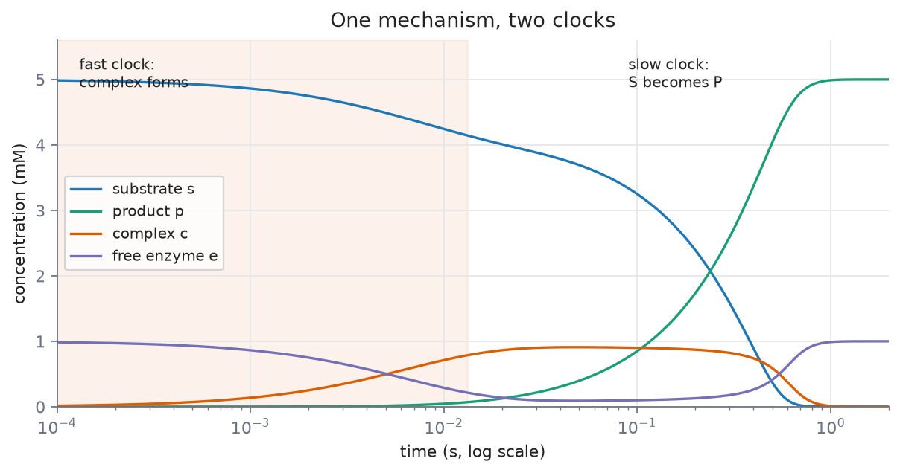

# L05 — Enzyme Kinetics I: the mechanism and the Michaelis-Menten equation

**Practical:** [](https://colab.research.google.com/github/lab-biotek-bio-ugm/TKBM262615_Practicals/blob/main/notebooks/03_enzyme_kinetics_I.ipynb) `03_enzyme_kinetics_I`

*Source: Ingalls Ch. 3, §3.1.*

By the end of this lecture you should be able to:

1. Write the mass-action equations for the mechanism $E + S \rightleftharpoons ES \to E + P$ and use the enzyme conservation to remove one of them.
2. State the quasi-steady-state assumption (QSSA) for the ES complex, give **both** independent reasons the complex is fast, and explain why the result is a function of time rather than a constant.
3. Derive the Michaelis-Menten equation from that assumption, naming every simplification used.
4. Read $V_{max}$ and $K_M$ off a curve, say what each does and does not depend on, and give the condition under which $K_M$ may be read as a binding affinity.

## Retrieval: what L04 left you holding

Answer from memory:

1. Why is a conservation relation exact, and why is a reduction using one free?
2. What does Euler's method assume across a single step?
3. You halve the step size. What happens to the error?

<details>
<summary>Answers</summary>

1. Because a conservation follows from the **structure** of the network — which arrows exist — not
   from the values of the rate constants. Nothing is approximated; the reduced model is the same
   model, written shorter.
2. That the rate holds constant across that step. It does not, and that is the entire error.
3. It halves. That is what "first-order method" means, and it is a bad deal.

</details>

Number 1 is the one today needs most. You will use a conservation once, exactly, and then fifteen
minutes later use a reduction that looks identical on the board and is a bet. Keeping those two
apart is the real intellectual work of this lecture.

## The hook: a straight line that is not there

Mass action for $S \to P$ predicts a rate $k[S]$: proportional to substrate, forever, a straight
line through the origin with no ceiling.

What is actually measured for an enzyme-catalysed reaction is a curve that bends over and flattens
towards a limit as substrate rises. You met this shape back in L01 as
[[saturation|"the shape biology uses to build a switch or a ceiling"]], with no mechanism attached.
Today it gets one.

Which is wrong, the law or the measurement?

Neither. Mass action is being asked a question it was never built to answer.

---

# Part 1 — What an enzyme actually does

## Lowers the barrier, not the destination

An enzyme is a protein that binds its substrate at an **active site** complementary to it in shape
and chemistry — the lock-and-key picture. Binding lowers the energy barrier the reactants must
climb to reach the high-energy **transition state**, so the reaction proceeds faster **in both
directions**.

That phrase "in both directions" carries us to the next point.

## The equilibrium is untouched, and it has to be

The position of equilibrium is set by the energies of reactants and products. An enzyme touches
neither — it only lowers the barrier between them. Both directions speed up by the same factor, so
the ratio at equilibrium is unchanged.

This is worth deriving as a consequence rather than accepting as a rule. Suppose a catalyst *could*
shift an equilibrium. Then you could add it to push a reaction one way, remove it, add a different
catalyst to push the reverse reaction, and cycle the two forever, extracting net work from nothing.
A perpetual motion machine.

Since that is physically impossible, catalysis cannot shift an equilibrium. The rule is a theorem,
not an empirical footnote.

## One arrow is three reactions

Here is the diagnosis, and the whole lecture rests on it.

"$S \to P$, catalysed by an enzyme" is **not an elementary reaction**. It is binding, unbinding and
conversion. Mass action applies perfectly well to those three steps — it simply does not apply to
the lump.

Mass action did not fail. We applied it at the wrong level. The remedy: descend one level to the
elementary reactions, apply mass action there, then climb back.

Every saturating rate law in this course comes from that manoeuvre.

## The mechanism

The full picture (equation 3.1) has two complexes, enzyme-substrate and enzyme-product:

$$S + E \rightleftharpoons C_1 \rightleftharpoons C_2 \rightleftharpoons P + E$$

Two simplifications, and Ingalls states both openly rather than smuggling them in:

1. **Lump $C_1$ and $C_2$**, assuming their interconversion is fast compared with association and
   dissociation. This is itself a rapid-equilibrium assumption.
2. **Product never rebinds free enzyme.** Justified because "laboratory measurements of reaction
   rates are typically carried out in the absence of product". This is what makes the resulting rate
   law **irreversible**; the reversible version is equation (3.9).

What remains, and what this course uses:

$$S + E \;\underset{k_{-1}}{\overset{k_1}{\rightleftharpoons}}\; C \;\overset{k_2}{\longrightarrow}\; P + E \tag{3.2}$$

$k_2$ is the **catalytic constant**, often written $k_{cat}$.

## Why saturation has to happen

Before reading on: what would have to be true for the rate to stop rising as you keep adding
substrate?

The answer: **you run out of enzyme.** The enzyme pool is limited. At high substrate every active
site is occupied, and adding more S barely moves the rate at all.

Saturation now has a physical cause, not merely a curve shape.

---

# Part 2 — Writing the equations down

## Mass action, one arrow at a time

Each arrow in (3.2) is an elementary reaction, so [[law-of-mass-action|mass action]] applies to
each. With $s, e, c, p$ for the concentrations:

$$\frac{ds}{dt} = -k_1se + k_{-1}c$$
$$\frac{de}{dt} = k_{-1}c - k_1se + k_2c$$
$$\frac{dc}{dt} = k_1se - k_{-1}c - k_2c$$
$$\frac{dp}{dt} = k_2c$$

Four species, four equations. This is pure L03 practice, and it should feel easy.

## A mirror symmetry, not a coincidence

Look at the equations for $e$ and for $c$. Every term in one appears negated in the other:

$$\frac{de}{dt} = -\frac{dc}{dt}$$

If two derivatives are always exactly opposite, what can you say about their **sum**?

Zero. And a quantity whose derivative is zero is a constant. You have just derived a conservation
by Route 2 from L04, on a system that genuinely matters.

## The enzyme conservation

$$e_T = e + c = \text{constant}$$

Free enzyme plus bound enzyme, fixed for all time. The enzyme is a **conserved moiety**: it is not
consumed by the reaction, only occupied. This is the example promised last week.

Substitute $e = e_T - c$ and the equation for $e$ disappears entirely:

$$\frac{ds}{dt} = -k_1s(e_T - c) + k_{-1}c$$
$$\frac{dc}{dt} = k_1s(e_T - c) - k_{-1}c - k_2c \tag{3.3}$$
$$\frac{dp}{dt} = k_2c$$

**This reduction is exact.** Nothing is approximated. Hold on to that, because in twenty minutes
you will see a manoeuvre that looks identical on the board and is not.

## An honest stopping point

Three equations remain, and the system is still **nonlinear**: there is an $sc$ product in it, and
that product will not integrate by hand.

We have used the only exact reduction available and still cannot solve it.

That is what makes the next move **necessary**, rather than merely convenient.

---

# Part 3 — The quasi-steady-state assumption

## Two clocks in one mechanism

Look at Ingalls' Figure 3.3A. There are two timescales inside the same mechanism:

- **Fast.** S and E associate and dissociate.
- **Slow.** S is converted through to P.

Reactions can differ in speed by orders of magnitude, and when the difference is large enough you
may treat the fast one as instantaneous relative to the slow one. The rule of thumb is a factor of
ten.

This is not new machinery. It is an observation about clocks.



*Figure: the four mass-action equations integrated with Ingalls' constants (`figs/mechanism_timecourse.py`). The complex is half-formed after 0.0044 s; half the substrate has become product only after 0.29 s. The two clocks differ by a factor of about 66, comfortably more than ten. Throughout, $e + c$ stays at $e_T$ to within $10^{-15}$ mM, which is the conservation of Part 2 checked numerically.*

## Two independent reasons C is fast

Ingalls names both, and both deserve equal weight:

1. **A difference in time constants.** $\frac{1}{k_1 + k_{-1}}$ for association and dissociation,
   against $\frac{1}{k_2}$ for product formation.
2. **A difference in concentrations.** "For many reactions in the cell, the substrate is far more
   abundant than the enzyme ($s \gg e_T$)."

The second is the one students overlook, and it is often the dominant one. If substrate vastly
outnumbers enzyme, the enzyme pool fills and empties many times over while the substrate
concentration has barely moved — so from the substrate's point of view, the complex has already
finished adjusting.

Remember reason 2. At the end of the lecture it is what will limit the validity of our result.

## The procedure, stated generally first

**The unit of approximation is a species**, not a reaction. The condition: **every** reaction
touching that species must be fast. If even one slow reaction touches it, it cannot keep up.

For C: binding ($k_1$), unbinding ($k_{-1}$) and conversion ($k_2$) all touch C, and all three are
fast compared with the rate at which $s$ changes.

The procedure:

1. Identify the fast species.
2. Replace its differential equation with an **algebraic** one: set the right-hand side to zero and
   solve.
3. Substitute the result into the remaining equations.
4. Recover the fast species from its algebraic formula whenever you need it.

## Applying it to the complex

Take equation (3.3) for $c$ and set the right-hand side to zero:

$$0 = k_1s(e_T - c^{qss}) - k_{-1}c^{qss} - k_2c^{qss}$$

Expand the first term:

$$0 = k_1se_T - k_1sc^{qss} - k_{-1}c^{qss} - k_2c^{qss}$$

Collect everything containing $c^{qss}$ on one side:

$$k_1se_T = c^{qss}\left(k_{-1} + k_2 + k_1s\right)$$

And divide:

$$c^{qss}(t) = \frac{k_1e_T\,s(t)}{k_{-1} + k_2 + k_1s(t)}$$

That collection-of-terms step looks trivial written out here, but it is where most students lose
the thread when doing it themselves. Redo it on paper without looking.

## This is not a constant

Look at what is on the right-hand side. There is an $s(t)$ in it. So $c^{qss}$ is a **function of
time**; it moves whenever $s$ moves.

This is the most commonly mangled idea in the whole chapter, and the cause is the shorthand
everyone uses. Ingalls warns about it explicitly:

> This procedure is sometimes summarized as "set $\frac{d}{dt}c^{qss}(t)$ to zero". However, this is
> a problematic statement because it **suggests that we are setting $c^{qss}(t)$ to a constant
> value, which is not the case.**

The correct way to say it:

> We are replacing the **differential** description of $c(t)$ with an **algebraic** description that
> says [C] instantaneously reaches the steady state it would attain if all other variables were
> constant. Because it equilibrates rapidly, the other variables are essentially constant "from C's
> point of view", i.e. on its fast time-scale.

The phrase to keep is **"from C's point of view"**. On its own fast timescale, $s$ has not had time
to move, so C relaxes to the steady state appropriate to the current $s$. Then $s$ drifts a little,
and C follows instantly.

C is not frozen. C is **always caught up**.

The rigorous version is **singular perturbation** theory, which gives explicit error bounds — Segel
and Slemrod (1989).

## The evidence, numerically

Panel B of this lecture's figure tests that claim directly. At $e_T = 0.1$ mM against $s(0) = 5$ mM
— a cell-like ratio — the solid curve is the true $c(t)$ from the full mechanism, and the dashed
curve is the algebraic formula $c^{qss}(s(t))$, which contains **no derivative at all**.

After a short transient they agree to 2.3% of the enzyme pool. And both of them move throughout,
tracking the $s(t)$ drawn thinly beneath.

## What if we simply assume equilibrium?

A reasonable question, and the answer carries both historical and conceptual value.

**Michaelis and Menten (1913)** assumed the binding step $S + E \rightleftharpoons C$ sits at
**equilibrium**. That is a different assumption: its unit is a **reaction**, not a species. It gives
a rate law of the same form, but with

$$K_M = \frac{k_{-1}}{k_1} = K_S$$

a pure dissociation constant.

**Briggs and Haldane (1925)** applied the QSSA to the complex, as we have just done, and got

$$K_M = \frac{k_{-1} + k_2}{k_1}$$

Same curve, same data, different decomposition. This is Ingalls Exercise 3.1.1, and part of this
week's fading problem set.

Why do we use the second? Because the equilibrium assumption is more fragile, and the reason is
structural. Look at the comparison figure on the simpler network: the equilibrium assumption
imposes $[B]/[A] = k_1/k_{-1}$, which the true steady state does **not** satisfy when flux runs
through that reaction — if there is flux, the forward rate does not equal the reverse rate, by
definition. So its error never closes. The QSSA imposes $\frac{dc}{dt} = 0$, which is **exactly**
the condition the true steady state does satisfy, so its error does close.

| | Assumes | Error during transient | Error at steady state |
|---|---|---|---|
| Rapid equilibrium | a **reaction** is at equilibrium | yes | **yes, persistent** |
| Quasi-steady state | a **species** is at steady state | yes | none |

One structural fact explains both fates.

---

# Part 4 — The Michaelis-Menten equation

## Substitute back

The rate of product formation is $k_2c$ — it always was, since we wrote the fourth equation. What
is new is that $c$ now has a formula in $s$:

$$\frac{dp}{dt} = -\frac{ds}{dt} = \frac{k_2k_1e_T\,s}{k_{-1} + k_2 + k_1s} \tag{3.4}$$

This is what we were after: **rate as a function of substrate concentration alone**, with no
differential equation for the complex.

Let that messy form sit for a moment before tidying it. You need to see the mess first, so that the
next step reads as tidying-up rather than as a definition falling out of the sky.

## Tidy it, then name what appears

Divide numerator and denominator by $k_1$:

$$v = \frac{k_2e_T\,s}{\frac{k_{-1}+k_2}{k_1} + s}$$

Two groupings appear. Neither was planned. Name them now:

$$\boxed{\;V_{max} = k_2e_T, \qquad K_M = \frac{k_{-1} + k_2}{k_1}, \qquad
v = \frac{V_{max}\,s}{K_M + s}\;} \tag{3.5}$$

**Derived, not postulated.** The form is called **hyperbolic**, because the curve is part of a
hyperbola (Figure 3.4).

Stop here for a moment. This is the most important derivation in the course, and every symbol in it
has an origin you can point at.

---

# Part 5 — Reading the two constants

This is where the understanding lives, not in the algebra.

## $V_{max} = k_2e_T$ — a property of the tube, not of the protein

The limiting rate, approached but never reached. It is the catalytic constant times the **total**
enzyme, which is what "the entire enzyme pool working at full capacity" means quantitatively. Units:
concentration·time⁻¹.

**$V_{max}$ is proportional to how much enzyme you happen to have.** Double the enzyme concentration
and $V_{max}$ doubles. So it is not a property of the enzyme alone.

If two laboratories report different $V_{max}$ for the same enzyme, they may both be right.

## $k_{cat}$ — the property of the protein

$$k_{cat} = \frac{V_{max}}{e_T} = k_2$$

Turnovers per enzyme molecule per second. Units: time⁻¹. This is what you quote when you mean "how
good is this enzyme".

## $K_M$ — the half-saturating concentration

Substitute $s = K_M$ into (3.5):

$$v(K_M) = \frac{V_{max}K_M}{K_M + K_M} = \frac{V_{max}}{2}$$

One line, and it turns $K_M$ from a formula you memorise into something you can point at on a graph.
Units: concentration. It sets **where** on the substrate axis the curve bends.

Double the enzyme: $V_{max}$ doubles, $K_M$ **does not move**. That is the diagnostic separating the
two constants, and it is what you will use next week to tell types of inhibition apart.

## Two regimes, one curve

$$s \ll K_M:\; v \approx \frac{V_{max}}{K_M}s \qquad\qquad s \gg K_M:\; v \approx V_{max}$$

At low substrate the denominator is about $K_M$ alone, so the rate is **linear in $s$** — the
first-order regime. At high substrate the denominator is about $s$ alone, the $s$ cancels, and the
rate stops caring about substrate — the zero-order regime.

These two limits are how you read any saturating curve, not only an enzyme's.

## What a cell can and cannot control

- **The linear regime.** The enzyme reports substrate supply. Raise substrate, the rate rises in
  proportion.
- **The saturated regime.** The enzyme itself is the bottleneck. Substrate no longer matters.

The engineering consequence is immediate: your metabolic pathway is slow and its enzyme is
saturated — how do you speed it up? **Not** by adding substrate. Raise the enzyme's expression, or
find a variant with a higher $k_{cat}$.

This is where Ch. 3 stops being algebra.

## Where the reduction breaks

> [!warning] $K_M$ is not a binding affinity
> You may have been taught that "$K_M$ measures how tightly the enzyme binds its substrate". That is
> true **only** when $k_2 \ll k_{-1}$, which makes $K_M \approx k_{-1}/k_1$, the dissociation
> constant. When catalysis is fast, $k_2$ dominates and $K_M$ is a mixture of binding and turnover —
> an enzyme with a large $K_M$ may bind its substrate very tightly indeed.
>
> Ingalls adds a related point in Exercise 3.1.1: the original Michaelis-Menten derivation used
> rapid equilibrium and gives a **different** formula for $K_M$. Both fit the same data. His
> conclusion is worth quoting: "Experimental characterizations of Michaelis-Menten rate laws involve
> direct measurement of $K_M$ and $V_{max}$, so the relation between $K_M$ and the individual
> kinetic constants is not significant."
>
> What is measured is $K_M$ and $V_{max}$. Their decomposition into elementary rate constants
> depends on which approximation you used to derive them.

Three other places the reduction breaks:

1. **During the fast transient**, by construction — the first moments after mixing, before C has
   built up.
2. **When the enzyme is not scarce.** Substrate sitting inside the complex C is not free S, but the
   reduced model has nowhere to hide it, so it counts that substrate as still free. This is the
   **sequestration** effect, and its size scales with $e_T$:

   | $e_T$ (mM) | max gap in [S] | as % of $s(0)$ |
   |---|---|---|
   | 1.0 | 0.842 mM | 16.8% |
   | 0.1 | 0.087 mM | 1.7% |
   | 0.01 | 0.009 mM | 0.2% |

   Ingalls exaggerates the error in the book's figure deliberately, so that the mechanism is
   visible. In his own words: "In the cell, the ratio of substrate to enzyme molecules is typically
   much higher than in this simulation, so the sequestration effect is negligible." This is reason 2
   from Part 3 coming back to collect.

3. **When product accumulates**, since the irreversible form assumed product never rebinds. Use
   equation (3.9).

## The code

```python
# /// script
# dependencies = ["numpy", "scipy"]
# ///
"""The full mechanism against the Michaelis-Menten reduction. Ingalls Figure 3.3 parameters."""
import numpy as np
from scipy.integrate import solve_ivp

k1, km1, k2 = 30.0, 1.0, 10.0        # /mM/s, /s, /s
KM = (km1 + k2) / k1
s0 = 5.0                             # mM

def full(t, y, eT):
    """Model (3.3): s, c, p. The enzyme conservation supplies e."""
    s, c, p = y
    e = eT - c
    return [-k1 * s * e + km1 * c,
            k1 * s * e - km1 * c - k2 * c,
            k2 * c]

def reduced(t, y, eT):
    """Model (3.4): s and p only. The complex is gone."""
    v = (k2 * eT) * y[0] / (KM + y[0])
    return [-v, v]

tol = dict(rtol=1e-11, atol=1e-14, dense_output=True)
print(f"KM = {KM:.4f} mM")
for eT in (1.0, 0.1, 0.01):
    t_end = 1.0 / eT                 # the reaction timescale goes like s0 / (k2 * eT)
    t = np.linspace(0, t_end, 2000)
    F = solve_ivp(full, [0, t_end], [s0, 0.0, 0.0], args=(eT,), **tol)
    R = solve_ivp(reduced, [0, t_end], [s0, 0.0], args=(eT,), **tol)
    s_full, c_full, _ = F.sol(t)
    gap = np.max(R.sol(t)[0] - s_full)
    # does the algebraic formula really track the true complex?
    after = t > 0.05 * t_end
    track = np.max(np.abs(c_full - k1 * eT * s_full / (km1 + k2 + k1 * s_full))[after])
    print(f"eT={eT:<6g} Vmax={k2 * eT:<6g} max [S] gap={gap:.4f} mM"
          f"  ({gap / s0 * 100:5.2f}% of s0)   max |c - c_qss|={track:.5f} mM")
```

Output:

```
KM = 0.3667 mM
eT=1      Vmax=10     max [S] gap=0.8424 mM  (16.85% of s0)   max |c - c_qss|=0.16211 mM
eT=0.1    Vmax=1      max [S] gap=0.0871 mM  ( 1.74% of s0)   max |c - c_qss|=0.00248 mM
eT=0.01   Vmax=0.1    max [S] gap=0.0087 mM  ( 0.17% of s0)   max |c - c_qss|=0.00003 mM
```

Notice that **both** error columns shrink with $e_T$, though at different rates: the [S] gap falls
roughly in proportion to $e_T$, while the complex-tracking error falls faster still. That is not a
coincidence — both are symptoms of the same condition, $s \gg e_T$, and both vanish together once
that condition holds comfortably.
