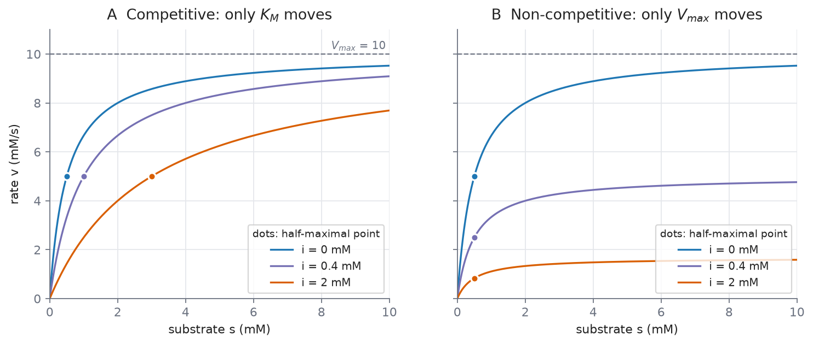
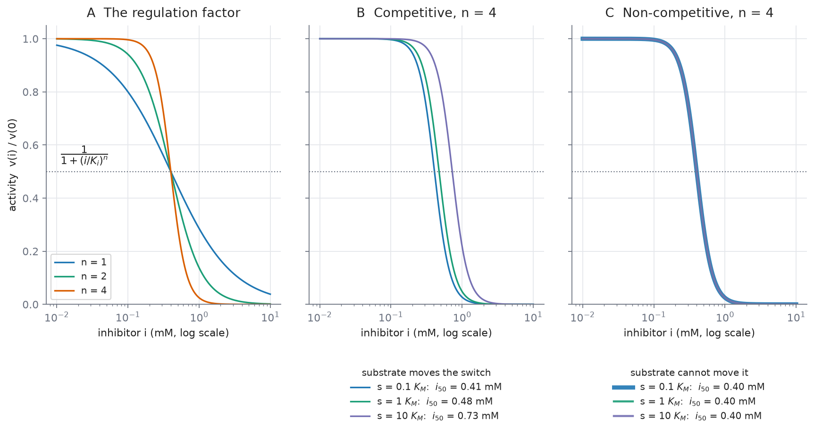
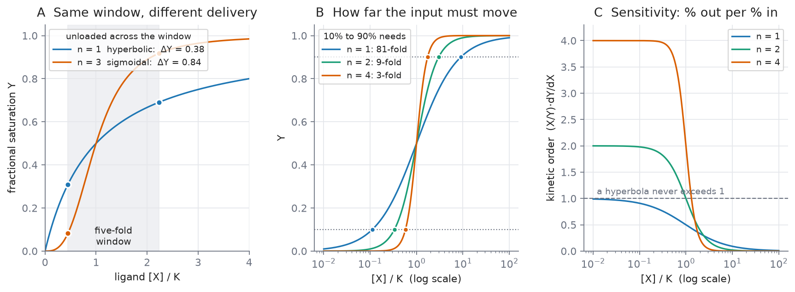
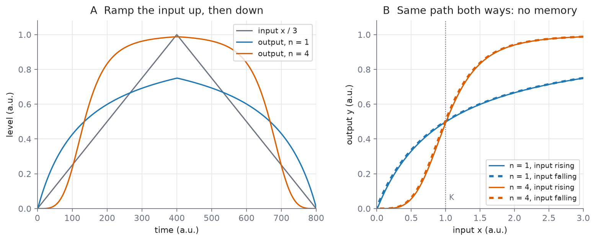

# L06 — Enzyme Kinetics II: inhibition, cooperativity and soft switches

**Practical:** [](https://colab.research.google.com/github/lab-biotek-bio-ugm/TKBM262615_Practicals/blob/main/notebooks/04_enzyme_kinetics_II.ipynb) `04_enzyme_kinetics_II`

*Source: Ingalls Ch. 3, §3.2–§3.3*

By the end of this lecture you should be able to:

1. Derive the rate law for competitive inhibition, say what a competitive and a non-competitive
   inhibitor each do to $V_{max}$ and $K_M$, and tell the two apart from a pair of measurements.
2. Explain why a protein with several independent binding sites still has a hyperbolic binding
   curve, derive the Hill function from simultaneous binding, and say what the Hill coefficient
   does and does not measure.
3. Write Hill-type rate laws for a cooperatively binding competitive or non-competitive inhibitor,
   and say how substrate changes the inhibitor dose needed to halve the rate in each case.
4. Explain why a sigmoidal response works as a *soft* switch: quantify its sharpness with the
   10%–90% span and the kinetic order, and say what it cannot do without feedback.

## Retrieval: what L05 left you holding

From memory, no notes:

1. You double the enzyme concentration. What happens to $V_{max}$, and to $K_M$?
2. In $c^{qss}(t) = \frac{k_1e_Ts(t)}{k_{-1}+k_2+k_1s(t)}$, is the complex constant?
3. When may $K_M$ be read as a binding affinity?

<details>
<summary>Answers</summary>

1. $V_{max} = k_2e_T$ doubles; $K_M = (k_{-1}+k_2)/k_1$ does not change, because it contains no
   $e_T$.
2. No. It depends on $s(t)$, so it moves whenever the substrate moves. The QSSA replaces a
   differential equation with an algebraic one; it does not freeze the complex.
3. Only when $k_2 \ll k_{-1}$, where $K_M \approx k_{-1}/k_1$, the dissociation constant.

</details>

Question 1 is the one today leans on. Every mechanism below does its work by moving one of those two constants, or by changing the shape of the curve they describe.

## The hook: how would you turn a reaction down?

A cell needs to slow one particular reaction, now. Before any biology, list the ways you could slow
a catalysed reaction in general.

Most lists contain two ideas: make less catalyst, or stop the catalyst you have from working. Making
less enzyme is genetic control, and it takes minutes to hours ([[enzyme-catalysis]]). Today is the
fast option: a small molecule binds the enzyme and changes what it does. There are two ways for that molecule to act, and they leave different fingerprints on the curve.

---

# Part 1 — Competitive inhibition

## An impostor at the active site

A **competitive inhibitor** mimics the substrate closely enough to bind the active site, but it does
not react. While it sits there, that enzyme molecule makes no product.

Ingalls' example: **ibuprofen** binds the active site of cyclooxygenase and so inhibits the
production of prostaglandins, which are involved in pain pathways, blood clotting and the
production of stomach mucus. The last item is why the drug can upset a stomach: the same inhibition, in a tissue where you did not want it.

"Competitive" is meant literally. Substrate and inhibitor compete for one site, so whichever is more
abundant wins more often. Hold that sentence; the algebra below ends up saying the same thing.

## The scheme

Add inhibitor binding to the mechanism from L05:

$$S + E \underset{k_{-1}}{\overset{k_1}{\rightleftharpoons}} C \overset{k_2}{\longrightarrow} E + P,
\qquad I + E \underset{k_{-3}}{\overset{k_3}{\rightleftharpoons}} C_I$$

$C_I$ is the enzyme-inhibitor complex. It is a dead end: the only way out is back to $E$ and $I$.
Here $k_3$ is a binding rate constant (concentration$^{-1}$·time$^{-1}$) and $k_{-3}$ an unbinding
rate constant (time$^{-1}$).

## The derivation, step by step

You are about to do L05's derivation again with one more complex. Write $c$ and $c_I$ for the two
complex concentrations and $i$ for the inhibitor concentration.

**Step 1 — mass action for the two complexes.**

$$\frac{dc}{dt} = k_1se - k_{-1}c - k_2c \qquad\qquad \frac{dc_I}{dt} = k_3ei - k_{-3}c_I$$

**Step 2 — freeze the inhibitor.** Treat $i$ as a fixed number. Ingalls justifies this by presuming
the inhibitor is far more abundant than the enzyme, so forming $C_I$ barely changes $i$. This is a
slow variable turned into a parameter, the same move as treating enzyme abundance as fixed.

**Step 3 — QSSA on both complexes.** Set each right-hand side to zero.

From the inhibitor complex:

$$0 = k_3ei - k_{-3}c_I \quad\Longrightarrow\quad c_I = \frac{k_3}{k_{-3}}\,e\,i = \frac{e\,i}{K_i},
\qquad K_i = \frac{k_{-3}}{k_3}$$

$K_i$ is the **dissociation constant** of the inhibitor, a concentration. A small $K_i$ means a
tightly binding inhibitor.

From the substrate complex:

$$0 = k_1se - (k_{-1}+k_2)c \quad\Longrightarrow\quad e = \frac{(k_{-1}+k_2)}{k_1}\cdot\frac{c}{s}
= \frac{K_M\,c}{s}$$

**Step 4 — the enzyme conservation, now with three terms.** Every enzyme molecule is free, holding a
substrate, or holding an inhibitor:

$$e_T = e + c + c_I$$

Replace $c_I$ by $e\,i/K_i$, so that $e + c_I = e\left(1 + \frac{i}{K_i}\right)$, then replace $e$
by $K_Mc/s$:

$$e_T = \frac{K_M\,c}{s}\left(1 + \frac{i}{K_i}\right) + c$$

Multiply both sides by $s$ and collect $c$:

$$e_Ts = c\left[K_M\left(1 + \frac{i}{K_i}\right) + s\right]
\quad\Longrightarrow\quad
c = \frac{e_T\,s}{K_M\left(1 + \dfrac{i}{K_i}\right) + s} \tag{3.13}$$

**Step 5 — the rate.** Product is still made only from $C$, at rate $k_2c$. With
$V_{max} = k_2e_T$:

$$\boxed{\;v = \frac{V_{max}\,s}{K_M\left(1 + \dfrac{i}{K_i}\right) + s}\;}$$

Check the units: $i/K_i$ is a concentration over a concentration, so the bracket is a pure number,
the denominator is a concentration, and $v$ has the units of $V_{max}$. Check the limit: with
$i = 0$ you get L05's law back.

## Reading the result

Compared with the uninhibited law, one thing changed: $K_M$ is multiplied by
$\left(1 + \frac{i}{K_i}\right)$, which is always larger than 1.

- **$V_{max}$ does not change.** As $s \to \infty$ the denominator is dominated by $s$ whatever $i$
  is, so the rate still approaches $V_{max}$.
- **The effective Michaelis constant rises** to $K_M\left(1 + \frac{i}{K_i}\right)$. You need more
  substrate to reach any given fraction of $V_{max}$.

Worked numbers, with $V_{max} = 10$ mM/s, $K_M = 0.5$ mM, $K_i = 0.4$ mM:

| $i$ (mM) | effective $K_M$ (mM) | $v$ at $s = 0.5$ mM | $v$ at $s = 50$ mM |
| -------- | -------------------- | ------------------- | ------------------ |
| 0        | 0.50                 | 5.00                | 9.90               |
| 0.4      | 1.00                 | 3.33                | 9.80               |
| 2.0      | 3.00                 | 1.43                | 9.43               |

At low substrate the highest inhibitor dose cuts the rate to under a third. At high substrate it
hardly registers. Ingalls: "When the substrate is much more abundant than the inhibitor, the
inhibition has only a negligible effect."

**Enough substrate always beats a competitive inhibitor.** For drug design that is a real limitation: how well a competitive drug works depends on the substrate concentration in the tissue,
which the designer does not control.

---

# Part 2 — Allosteric regulation and non-competitive inhibition

## A different site removes a constraint

A competitive inhibitor must fit the active site, so it must look like the substrate. That is a hard
restriction on which molecules can regulate an enzyme.

**Allosteric regulation** removes it. The regulator binds a different site, the **allosteric
site**, and changes the shape of the protein, and with it the behaviour of the active site. The name
comes from Greek *allo* (other) and *steros* (solid, or shape). The idea was proposed by François
Jacob and Jacques Monod in 1961.

Two consequences follow:

- The regulator **need not resemble the substrate** chemically at all.
- The allosteric site can differ from the active site in position and in chemistry.

So a cell can regulate an enzyme with a molecule that has nothing to do with the reaction. Typically
the regulator switches the protein between an active and an inactive form.

## The case Ingalls analyses

One allosteric inhibitor that blocks catalysis and, for simplicity, does not affect substrate
binding. Substrate and inhibitor bind independently. This is **non-competitive inhibition**, and its
scheme is a square with four enzyme states:

$$S + E \underset{k_{-1}}{\overset{k_1}{\rightleftharpoons}} ES \overset{k_2}{\longrightarrow} E + P
\qquad I + E \underset{k_{-3}}{\overset{k_3}{\rightleftharpoons}} EI$$
$$I + ES \underset{k_{-3}}{\overset{k_3}{\rightleftharpoons}} ESI
\qquad S + EI \underset{k_{-1}}{\overset{k_1}{\rightleftharpoons}} ESI$$

Look at the rate constants. Substrate binding uses $k_1, k_{-1}$ whether or not the inhibitor is
there; inhibitor binding uses $k_3, k_{-3}$ whether or not the substrate is there. That is what
"independent binding" means, written as rate constants. Only $ES$ makes product.

## The derivation

Ingalls applies the QSSA to $ES$, $EI$ and $ESI$ with the conservation
$e_T = [E] + [ES] + [EI] + [ESI]$. The clean route uses one extra assumption, stated here openly:
**the inhibitor-binding steps sit at equilibrium**, so each inhibitor-bound form is in the ratio
$i/K_i$ to its inhibitor-free partner:

$$[EI] = \frac{i}{K_i}[E], \qquad [ESI] = \frac{i}{K_i}[ES]$$

**QSSA on $ES$.** Its equation is

$$0 = k_1s[E] - (k_{-1}+k_2)[ES] - k_3i[ES] + k_{-3}[ESI]$$

The last two terms cancel, because $k_{-3}[ESI] = k_{-3}\frac{i}{K_i}[ES] = k_3i[ES]$. What is
left is L05's relation:

$$[E] = \frac{K_M}{s}[ES]$$

**Conservation.** Group the four forms in pairs:

$$e_T = [E]\left(1 + \frac{i}{K_i}\right) + [ES]\left(1 + \frac{i}{K_i}\right)
= \left(1 + \frac{i}{K_i}\right)[ES]\left(\frac{K_M}{s} + 1\right)$$

Solve for $[ES]$ and multiply by $k_2$:

$$\boxed{\;v = k_2[ES] = \frac{V_{max}}{1 + \dfrac{i}{K_i}}\cdot\frac{s}{K_M + s}\;} \tag{3.15}$$

> [!warning] How exact is (3.15)?
> Ingalls presents (3.15) as the result of the QSSA on the three complexes. Solving those three
> QSSA equations exactly, without the equilibrium assumption above, gives a longer expression that
> agrees with (3.15) only when catalysis is slow compared with substrate unbinding
> ($k_2 \ll k_{-1}$). The reason: with $k_2 > 0$ there is a net flux around the square, so the
> inhibitor-binding steps cannot all sit exactly at equilibrium. The code at the end of Part 4
> checks this. With $k_1 = 30$, $k_{-1} = 1$, $k_3 = 5$, $k_{-3} = 2$, $s = 0.1$, $i = 1$: at
> $k_2 = 10$ the exact QSSA rate is 1.48 times (3.15); at $k_2 = 0.1$ the ratio is 1.011.
> The qualitative lesson, which is the one to keep, holds in both cases: this inhibitor lowers the
> ceiling and substrate cannot overcome it.

## The exact mirror image

Put the two rate laws side by side:

$$\text{competitive: } v = \frac{V_{max}\,s}{K_M\left(1+\frac{i}{K_i}\right) + s}
\qquad\qquad
\text{non-competitive: } v = \frac{\frac{V_{max}}{1+\frac{i}{K_i}}\,s}{K_M + s}$$

The same factor $\left(1 + \frac{i}{K_i}\right)$ appears in both. In one it multiplies $K_M$; in the
other it divides $V_{max}$.

|                 | $V_{max}$                | $K_M$                       |
| --------------- | ------------------------ | --------------------------- |
| Competitive     | unchanged                | multiplied by $(1 + i/K_i)$ |
| Non-competitive | divided by $(1 + i/K_i)$ | unchanged                   |

Same constants as before ($V_{max} = 10$ mM/s, $K_M = 0.5$ mM, $K_i = 0.4$ mM):

| $i$ (mM) | effective $V_{max}$ (mM/s) | $v$ at $s = 0.5$ mM | $v$ at $s = 50$ mM |
| -------- | -------------------------- | ------------------- | ------------------ |
| 0        | 10.00                      | 5.00                | 9.90               |
| 0.4      | 5.00                       | 2.50                | 4.95               |
| 2.0      | 1.67                       | 0.83                | 1.65               |

At $s = 50$ mM the competitive inhibitor had almost no effect (9.43 against 9.90). The
non-competitive one still cuts the rate to a sixth (1.65). **You cannot outcompete an allosteric
inhibitor with substrate**, because it never competed for the substrate's site.



*Figure (`figs/inhibition_curves.py`): left, every competitive curve climbs to the same ceiling and
its half-maximal point moves right. Right, every non-competitive curve has its half-maximal point at
the same $s = K_M$, and the ceiling drops. Enzymologists tell the two mechanisms apart by exactly
this signature.*

Ingalls adds a caution: "More generally, other allosteric inhibition schemes impact both $V_{max}$
and $K_M$." One of them, **uncompetitive inhibition**, is Problem 3 of this week's set.

## Hinge question

> You measure $V_{max}$ and $K_M$ for an enzyme with and without a candidate drug. $V_{max}$ is
> unchanged; $K_M$ has tripled. What kind of inhibitor is it?
>
> **A.** Non-competitive — it is the one that changes a constant.
> **B.** Competitive — it raises $K_M$ and leaves $V_{max}$ alone.
> **C.** Cooperative — the tripling reflects a Hill coefficient.
> **D.** You cannot tell without the drug's chemical structure.

<details>
<summary>Answer</summary>

**B.** A swaps the fingerprints: the non-competitive inhibitor moves $V_{max}$, not $K_M$. C mixes
two topics: a Hill coefficient describes the shape of a binding curve, not a shift of $K_M$. D
misses that the two rate laws you have just derived answer the question from the numbers alone.
With $K_M$ tripled, $1 + i/K_i = 3$, so the drug is present at twice its $K_i$.

</details>

---

# Part 3 — Cooperativity and the Hill function

## Same chain, same ligand, different curve

**Haemoglobin** carries oxygen in vertebrate blood. It is a **tetramer**, four polypeptide chains,
and each chain binds one oxygen molecule. Plot the fraction of binding sites occupied against oxygen and the curve is **S-shaped (sigmoidal)**. When this was measured around 1900 it was a surprise:
"most binding curves are hyperbolic, not sigmoidal."

**Myoglobin** stores oxygen in muscle. It closely resembles a single haemoglobin chain: one chain,
one site. Its binding curve is **hyperbolic**.

Same kind of site, same ligand, different curve. So the sigmoid cannot come from the individual
site. It has to come from the **four chains influencing one another**. That is **cooperativity**:
binding events that could be independent but are not.

## Fractional saturation

For binding, the natural quantity is occupancy rather than rate. The **fractional saturation** $Y$
is the fraction of binding sites that hold a ligand (a *ligand* is any molecule that binds; Latin
*ligare*, to bind):

$$Y = \frac{\text{occupied sites}}{\text{total sites}}$$

For one site, $P + X \rightleftharpoons PX$, at equilibrium $k_1[P][X] = k_{-1}[PX]$, so
$[PX] = [P][X]/K$ with $K = k_{-1}/k_1$, the dissociation constant. Then

$$Y = \frac{[PX]}{[P] + [PX]} = \frac{[P][X]/K}{[P] + [P][X]/K} = \frac{[X]}{K + [X]} \tag{3.17}$$

This is the Michaelis-Menten shape again. Ingalls explains why: an enzyme's rate is proportional to
its fractional occupancy.

## Four sites are not enough

Do this step deliberately, because it is the one people skip. If the four sites are identical and
bind **independently**, the average occupancy is still (3.17). Each site fills as if it were alone;
having four of them only means four times as many sites. Ingalls' Problem 3.7.9 shows that even
independent sites with *different* affinities give a hyperbolic curve.

**Several sites do not make cooperativity.** The sites have to affect one another.

## When the sites do interact

For two identical, interacting sites, Ingalls' Exercise 3.3.1 gives the **Adair equation**:

$$Y = \frac{[X]/K_1 + [X]^2/(K_1K_2)}{1 + 2[X]/K_1 + [X]^2/(K_1K_2)}$$

with $K_1$, $K_2$ the dissociation constants of the first and second binding events. The curve is
sigmoidal when later binding is much tighter than earlier binding ($K_2 \ll K_1$): **positive
cooperativity**. The four-site version has the same structure with four constants; you will not
need to derive it.

## The Hill function, derived in three lines

Take the extreme case: binding is so cooperative that the $n$ ligands effectively bind at once
(Ingalls Exercise 3.3.3):

$$P + nX \underset{k_{-1}}{\overset{k_1}{\rightleftharpoons}} PX_n$$

At equilibrium, $k_1[P][X]^n = k_{-1}[PX_n]$, so $[PX_n] = [P][X]^n/K^n$ with $K^n = k_{-1}/k_1$.
The fraction of protein in the bound form is

$$Y = \frac{[PX_n]}{[P] + [PX_n]} = \frac{[X]^n/K^n}{1 + [X]^n/K^n}
= \boxed{\;\frac{[X]^n}{K^n + [X]^n}\;} \tag{3.19}$$

This is the **Hill function**, proposed by A. V. Hill in 1910. Two parameters:

- **$K$**, the half-saturating concentration. Substitute $[X] = K$ and you get $K^n/2K^n = 1/2$. It
  says *where* the switch sits.
- **$n$**, the **Hill coefficient**. It says *how sharply* the curve turns. At $n = 1$ the function
  is the hyperbola (3.17). As $n$ grows the curve becomes flatter below $K$, steeper through it and
  flatter above.

The same form appears for enzymes. An enzyme with two catalytic sites, strong cooperativity, and
catalysis only when both are filled (Exercise 3.3.4) has

$$v = \frac{V_{max}\,s^2}{K_M + s^2}$$

where this $K_M$ has units of concentration squared.

> [!warning] $n$ is not the number of binding sites
> Hill fitted haemoglobin, a four-site protein, and found the data best described by $n$ between
> **1 and 3.2**. Non-integer Hill coefficients are routine when fitting data, and a protein cannot
> have 2.7 sites. $n = 4$ appears in the derivation only under the extreme assumption that all four
> ligands bind together. Real cooperativity is partial, so fitted $n$ sits below the site count.
> Read $n$ as a measure of steepness. "$n$ clearly above 1" tells you some cooperativity is
> present; it does not count sites.

Hill himself treated (3.19) as a convenient curve for fitting, and "did not attach any significance
to the particular form of this function." Keep that in mind in Part 4, where the Hill function is
used as a *model* of regulation.

---

# Part 4 — Hill functions as models of regulation

## A cooperative inhibitor

In Parts 1 and 2 one inhibitor molecule bound one enzyme. Now suppose the inhibitor binds
cooperatively, strongly enough that $n$ inhibitor molecules effectively bind together, exactly as
in the derivation of (3.19):

$$nI + E \underset{k_{-3}}{\overset{k_3}{\rightleftharpoons}} EI_n$$

> [!note] Inference
> The two rate laws below are not printed in Ingalls Ch. 3. They combine the §3.2 schemes with the
> simultaneous-binding step of Exercise 3.3.3, and the derivations are given in full so you can
> check them. Ingalls' Problem 3.7.8(b) does the same thing for an allosteric *activator*.

**Competitive.** Repeat Part 1, Step 3, with the new binding step. Its QSSA is
$0 = k_3ei^n - k_{-3}c_I$, so

$$c_I = e\left(\frac{i}{K_i}\right)^n, \qquad K_i^n = \frac{k_{-3}}{k_3}$$

Everything else in Part 1 is unchanged; $\frac{i}{K_i}$ is simply replaced by
$\left(\frac{i}{K_i}\right)^n$:

$$\boxed{\;v = \frac{V_{max}\,s}{K_M\left(1 + \left(\dfrac{i}{K_i}\right)^n\right) + s}\;}$$

**Non-competitive.** Repeat Part 2 the same way (with the same equilibrium assumption for the
inhibitor steps, and the same caveat):

$$\boxed{\;v = \frac{V_{max}}{1 + \left(\dfrac{i}{K_i}\right)^n}\cdot\frac{s}{K_M + s}\;}$$

Look at the factor in front in the second law:

$$\frac{1}{1 + (i/K_i)^n} = \frac{K_i^n}{K_i^n + i^n}$$

It is a **decreasing Hill function** of the inhibitor: 1 when there is no inhibitor, $\frac{1}{2}$
at $i = K_i$, and falling towards 0, more sharply the larger $n$ is. Written this way, the
regulation is a separate multiplier on an ordinary Michaelis-Menten rate. That separation is what
makes Hill factors convenient building blocks in larger models: you can bolt a regulation term onto
a rate law without rederiving the whole mechanism. Ingalls signals that such switch-like terms
return in later chapters.

## Does substrate move the switch?

Ask each law for the **half-inhibiting dose** $i_{50}$, the inhibitor concentration that halves the
rate at a given $s$.

**Non-competitive.** The factor does not contain $s$, so $\frac{1}{1 + (i/K_i)^n} = \frac{1}{2}$
gives $i_{50} = K_i$ at every substrate concentration.

**Competitive.** Divide the inhibited rate by the uninhibited one:

$$\frac{v(i)}{v(0)} = \frac{K_M + s}{K_M\left(1 + (i/K_i)^n\right) + s}$$

Set this equal to $\frac{1}{2}$ and cross-multiply:

$$K_M\left(1 + (i/K_i)^n\right) + s = 2K_M + 2s
\quad\Longrightarrow\quad
\left(\frac{i_{50}}{K_i}\right)^n = 1 + \frac{s}{K_M}$$

$$i_{50} = K_i\left(1 + \frac{s}{K_M}\right)^{1/n}$$

More substrate pushes the switch to higher inhibitor doses, as competition says it must. But look at
the exponent $1/n$. With $K_M = 0.5$ mM and $K_i = 0.4$ mM, raising $s$ from $0.1K_M$ to $10K_M$
moves $i_{50}$:

| | $s = 0.1K_M$ | $s = K_M$ | $s = 10K_M$ | shift |
|---|---|---|---|---|
| $n = 1$ | 0.44 mM | 0.80 mM | 4.40 mM | 10-fold |
| $n = 4$ | 0.41 mM | 0.48 mM | 0.73 mM | 1.8-fold |
| non-competitive, any $n$ | 0.40 mM | 0.40 mM | 0.40 mM | none |

A cooperative competitive inhibitor is much harder to push aside with substrate than a
non-cooperative one. The switch still moves, but only by the $n$-th root.



*Figure (`figs/hill_regulation.py`): A, the regulation factor for $n = 1, 2, 4$. B, a cooperative
competitive inhibitor ($n = 4$) at three substrate levels. C, a cooperative non-competitive
inhibitor at the same three levels: one curve.*

## An activator, for comparison

Ingalls' Problem 3.7.8 treats an allosteric **activator** $R$ that must bind before substrate can.
If $n$ activator molecules bind together, the rate law is

$$v = \frac{V_{max}\,s\,r^n}{K_1r^n + K_2 + r^ns}$$

Divide top and bottom by $(K_1 + s)$ and it separates into a Michaelis-Menten part and an
**increasing** Hill function of the activator:

$$v = \frac{V_{max}\,s}{K_1 + s}\cdot\frac{r^n}{r^n + K_2/(K_1 + s)}$$

Inhibitors give decreasing Hill factors; activators give increasing ones.

## The code

```python
# /// script
# dependencies = ["numpy"]
# ///
"""Hill-type inhibition: the half-inhibiting dose, and the sensitivity of the response."""
import numpy as np

# --- Parameters (edit and re-run) ---
KM = 0.5          # Michaelis constant, mM
Ki = 0.4          # inhibitor dissociation constant, mM

def i50_competitive(s, n):
    """Inhibitor dose that halves the rate: solve (i/Ki)^n = 1 + s/KM."""
    return Ki * (1 + s / KM) ** (1 / n)

def i50_noncompetitive(s, n):
    """The factor 1/(1 + (i/Ki)^n) does not involve s, so the answer is Ki at any s."""
    return Ki

for n in (1, 4):
    for s in (0.05, 0.5, 5.0):
        print(f"n={n}  s={s:<5g} mM   i50 competitive = {i50_competitive(s, n):.3f} mM"
              f"   non-competitive = {i50_noncompetitive(s, n):.3f} mM")

# kinetic order (sensitivity) of a Hill function, from its definition
def hill(x, n, K=1.0):
    return x**n / (K**n + x**n)

h = 1e-6
for n in (1, 2, 4):
    x = np.array([0.1, 1.0, 10.0])                     # in units of K
    order = x / hill(x, n) * (hill(x + h, n) - hill(x - h, n)) / (2 * h)
    print(f"n={n}: kinetic order at x = 0.1K, K, 10K  ->  {np.round(order, 3)}"
          f"   (formula n(1-Y): {np.round(n * (1 - hill(x, n)), 3)})")
```

Output:

```
n=1  s=0.05  mM   i50 competitive = 0.440 mM   non-competitive = 0.400 mM
n=1  s=0.5   mM   i50 competitive = 0.800 mM   non-competitive = 0.400 mM
n=1  s=5     mM   i50 competitive = 4.400 mM   non-competitive = 0.400 mM
n=4  s=0.05  mM   i50 competitive = 0.410 mM   non-competitive = 0.400 mM
n=4  s=0.5   mM   i50 competitive = 0.476 mM   non-competitive = 0.400 mM
n=4  s=5     mM   i50 competitive = 0.728 mM   non-competitive = 0.400 mM
n=1: kinetic order at x = 0.1K, K, 10K  ->  [0.909 0.5   0.091]   (formula n(1-Y): [0.909 0.5   0.091])
n=2: kinetic order at x = 0.1K, K, 10K  ->  [1.98 1.   0.02]   (formula n(1-Y): [1.98 1.   0.02])
n=4: kinetic order at x = 0.1K, K, 10K  ->  [4. 2. 0.]   (formula n(1-Y): [4. 2. 0.])
```

The second half is used in Part 5. The check of (3.15) promised in Part 2:

```python
# /// script
# dependencies = ["numpy"]
# ///
"""Non-competitive inhibition: the full QSSA on ES, EI and ESI, against Ingalls' (3.15)."""
import numpy as np

def rates(k1, km1, k2, k3, km3, s, i, eT=1.0):
    # unknowns [E, ES, EI, ESI]; rows: QSSA for ES, EI, ESI, then the conservation
    A = np.array([[k1 * s, -(km1 + k2) - k3 * i, 0.0, km3],
                  [k3 * i, 0.0, -km3 - k1 * s, km1],
                  [0.0, k3 * i, k1 * s, -km3 - km1],
                  [1.0, 1.0, 1.0, 1.0]])
    E, ES, EI, ESI = np.linalg.solve(A, [0.0, 0.0, 0.0, eT])
    KM, Ki = (km1 + k2) / k1, km3 / k3
    return k2 * ES, k2 * eT / (1 + i / Ki) * s / (KM + s)

# k1 /mM/s, k-1 /s, k2 /s, k3 /mM/s, k-3 /s ; s and i in mM ; rates in mM/s
for k2 in (10.0, 1.0, 0.1):
    full, closed = rates(30.0, 1.0, k2, 5.0, 2.0, s=0.1, i=1.0)
    print(f"k2 = {k2:<4g} (k-1 = 1):  full QSSA = {full:.4f}   eq. (3.15) = {closed:.4f}"
          f"   ratio = {full / closed:.3f}")
```

Output:

```
k2 = 10   (k-1 = 1):  full QSSA = 0.9066   eq. (3.15) = 0.6122   ratio = 1.481
k2 = 1    (k-1 = 1):  full QSSA = 0.1886   eq. (3.15) = 0.1714   ratio = 1.100
k2 = 0.1  (k-1 = 1):  full QSSA = 0.0211   eq. (3.15) = 0.0209   ratio = 1.011
```

The QSSA equations are linear in the four enzyme forms once $s$ and $i$ are fixed, which is why a
single call to `np.linalg.solve` finishes the job.

---

# Part 5 — Sigmoidal kinetics as soft switches

## Sensitivity: the kinetic order, extended

L05's further reading defined the **kinetic order** of a response as the percentage change in
output per percentage change in input:

$$\text{kinetic order} = \frac{x}{Y}\frac{dY}{dx}$$

For a hyperbola $Y = \frac{x}{K + x}$ it equals $\frac{K}{K + x}$: 1 at low $x$, falling to 0. It
**never exceeds 1**. A 1% change in input never produces more than a 1% change in output.

Now the Hill function. Differentiate $Y = \frac{x^n}{K^n + x^n}$ with the quotient rule:

$$\frac{dY}{dx} = \frac{nx^{n-1}(K^n + x^n) - x^n \cdot nx^{n-1}}{(K^n + x^n)^2}
= \frac{nx^{n-1}K^n}{(K^n + x^n)^2}$$

Multiply by $\frac{x}{Y} = \frac{K^n + x^n}{x^{n-1}}$:

$$\frac{x}{Y}\frac{dY}{dx} = \frac{nK^n}{K^n + x^n} = n\,(1 - Y)$$

At low input the kinetic order is $n$; at $x = K$ it is $n/2$; at high input it falls to 0. For
$n = 4$ (code output above): 4.0, 2.0 and 0.0. Below and around $K$, a 1% change in input gives up
to an $n$% change in output. The response **amplifies** relative changes, which a hyperbola cannot
do. That is the precise content of "switch-like".

Two other readings of the same fact:

- **Slope at half-saturation** (Exercise 3.3.2): $\frac{dY}{dx}\Big|_{x=K} = \frac{n}{4K}$,
  proportional to $n$.
- **The 10%–90% span.** Solve $Y = 0.1$: $(x/K)^n = 1/9$. Solve $Y = 0.9$: $(x/K)^n = 9$. The
  ratio of the two inputs is $81^{1/n}$:

$$\frac{x_{90}}{x_{10}} = 9^{2/n}$$

| $n$ | input change needed to go from 10% to 90% |
|---|---|
| 1 | 81-fold |
| 2 | 9-fold |
| 3 | 4.3-fold |
| 4 | 3-fold |

## Why haemoglobin needs it

Myoglobin **stores** oxygen: it should stay loaded except when oxygen is nearly gone, and a
hyperbola does that. Haemoglobin **shuttles**: it must load in the lungs and unload in working
muscle. The oxygen difference between the two is only about **five-fold**.

A hyperbolic carrier needs an 81-fold change to swing from 10% to 90%. At $n = 3$, near the top of
Hill's fits, 4.3-fold is enough. Cooperativity is what makes the transport job possible.



*Figure (`figs/cooperativity_switch.py`). A: across a five-fold window of ligand, placed around $K$
for illustration (Ingalls gives the width of the window, not its position), a hyperbola unloads
0.38 of its sites (from 0.69 to 0.31) and an $n = 3$ sigmoid unloads 0.84 (from 0.92 to 0.08).
B: the 10%–90% spans for $n = 1, 2, 4$. C: the kinetic order $n(1-Y)$.*

## Why "soft"?

A light switch has two positions and jumps between them. A sigmoid is not like that, in three ways.

1. **It is graded.** An intermediate input gives an intermediate output. For $n = 4$ and $K = 1$:
   input 0.5 gives 0.059, input 1 gives 0.5, input 2 gives 0.941. Steep, but continuous.
2. **It is reversible along the same path.** Lower the input and the output comes back down the
   same curve.
3. **It has no memory.** The output depends only on the present input, not on where the input has
   been.

The figure shows this with a small model built from pieces you already have: an output $y$ made at
a rate set by a Hill function of an input $x$, and removed by first-order decay (production and
decay, L03):

$$\frac{dy}{dt} = \alpha\frac{x^n}{K^n + x^n} - \delta\,y$$

in arbitrary units with $\alpha = \delta = K = 1$. The input ramps slowly from 0 to 3 and back.



*Figure (`figs/soft_switch.py`): A, the ramp and the two outputs. B, output against input for the
rising and falling halves. They lie on top of each other; the largest gap at equal input is 0.010
for $n = 1$ and 0.016 for $n = 4$, and it comes from the output lagging a moving input (Problem 6).*

A switch that **remembers**, like the toggle switch from L01, needs something more: feedback. In
that case study the model showed that nonlinearity in the protein-DNA binding is what lets mutual
repression form a switch with two stable states. Cooperative binding supplies the sigmoid; the
feedback loop supplies the memory.

> [!note] Inference
> "Soft switch" is this course's shorthand, not Ingalls' term. Ingalls calls the sigmoid
> "switch-like" and says the Hill coefficient is "commonly used as a measure of the switch-like
> character of a process." The contrast with a memory-carrying switch is drawn from the L01 toggle
> switch case study. See [[switch-like-response]].

Making $n$ very large sharpens the curve towards a step, but it still has no memory: a step function
is still a function of the present input.

---

# Part 6 — One technique, five rate laws

| Rate law | What was fast | Result |
|---|---|---|
| Michaelis-Menten (L05) | the complex $C$ | $\frac{V_{max}s}{K_M + s}$ |
| Competitive inhibition | $C$ and $C_I$ | $K_M \to K_M(1 + i/K_i)$ |
| Non-competitive inhibition | $ES$, $EI$, $ESI$ | $V_{max} \to V_{max}/(1 + i/K_i)$ |
| Cooperative binding | simultaneous binding at equilibrium | $\frac{x^n}{K^n + x^n}$ |
| Hill-type regulation | cooperative inhibitor binding | $i/K_i \to (i/K_i)^n$ |

Every row came from the same steps: write mass action for the elementary reactions, use a
conservation, replace the fast species' equations with algebra, substitute back, and read the
constants.
